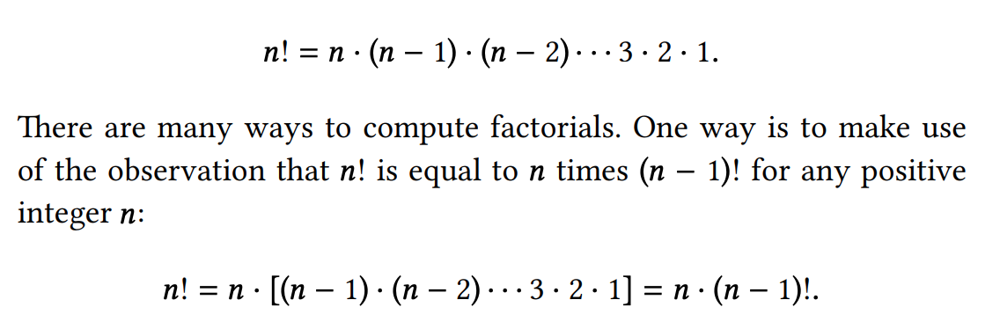
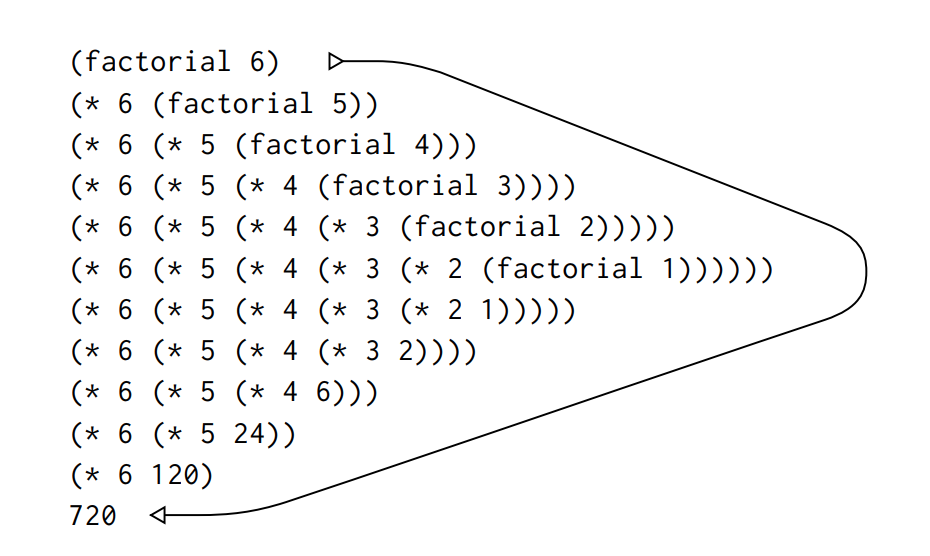
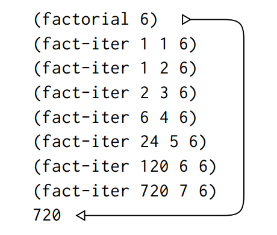
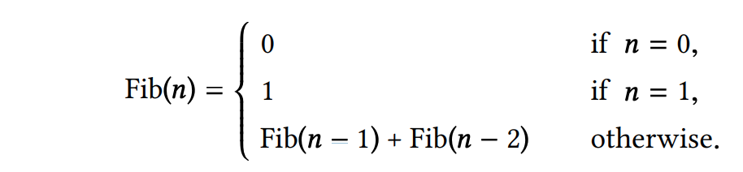
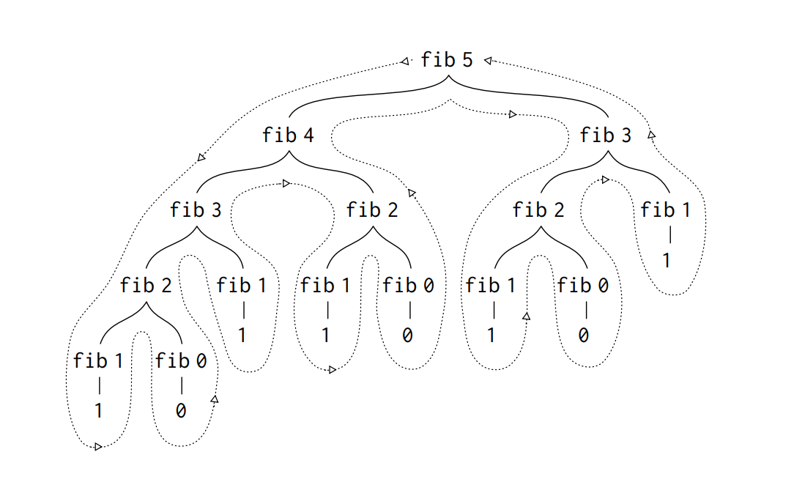

# 1. Building Abstractions with Procedures

## 1.1 Elements of Programming

**All programming languages have:  
  
primitive expressions**  
represent the simplest entities the language is concerned with  
  
**means of combination**  
by which compound elements are built from simpler ones   
  
**means of abstraction**  
 by which compound elements can be named and manipulated as units.  
  
In programming we deal with: **procedures** and **data**  
\(Though they are not as distinct as you would think.\)  
  


### Basics of Lisp

| \(+  | 2.7  | 10\) |
| :---: | :---: | :---: |
| operator | operand | operand |

Lisp's convention of placing operator to the left is called **prefix notation**.

The interpreter always run in the same cycle: **read-eval-print loop.** An expression like `(+ ( 3 (+ ( 2 4) (+ 3 5))) (+ (- 10 7) 6))` which may be hard for humans to parse, easy for the interpreter to answer.


| \(define  | size  | 2\) |
| :---: | :---: | :---: |
|  | variable | value |

The interpreter must maintain some sort of memory that keeps track of the name-object pairs. This memory is called the **environment**. \(eg: global environment\). 


#### Compound Procedures

`(define (square x) (* x x))`

\(define \(⟨name⟩ ⟨formal parameters⟩\) ⟨body⟩\)

  
  
**General form of a conditional:** 

**`(define (abs x) (cond ((< x 0) (- x)) (else x)))`**  
  
****\(cond \(⟨p1⟩ ⟨e1⟩\) \(⟨p2⟩ ⟨e2⟩\) . . . \(⟨pn⟩ ⟨en⟩\)\)

Conditional expressions are evaluated as follows. Predicate ⟨p1⟩ is evaluated first. If its value is false, then ⟨p2⟩ is evaluated. If ⟨p2⟩’s value is also false, then ⟨p3⟩ is evaluated. The process continues until a predicate is found whose value is true, in which case the interpreter returns the value of the corresponding consequent expression ⟨e⟩ of the clause as the value of the conditional expression. If none of the ⟨p⟩’s is found to be true, the value of the cond is undefined.   
  
**Lisp is an applicative order language.**

#### \*\*\*\*

###  Applicative order versus normal order \(aka lazy evaluation\)





Lazy evaluating is when a compiler only evaluates an expression when needed. This can be more efficient, for eg: short circuiting for &&. If the left side evaluates to false, then the right side is not evaluated. You can also work with infinite lists.


**Exercise 1.5**

What's the difference between trying to run the below code in an applicative order vs normal order compiler?

```text
(define (p) (p))
(define (test x y)
    (if (= x 0) 0 y))

(test 0 (p))
```

**Answer:**

In a strict evaluation/ applicative order compiler, the compiler is stuck at line one, which is a recursive function.   
  
In a lazy evaluation/ normal order compiler, since `p` is not needed yet, the compiler does not evaluate the first line. Since the parameter given satisfy the `(= x 0)` clause, '0' is returned as the result without even evaluating `y`.

### 

### Square Roots by Newton’s Method

Difference between mathematics functions and computer procedures: Procedures must be effective.

For eg, the mathematical function for finding the square root of a number can be defined as: **√ x = the y such that y ≥ 0 and y \*\* 2 = x**  
  
It is declarative rather than imperative. The imperative way of finding square root is through Newton’s method of successive approximations by averaging y with x/y.

For square root of 2:


The pseudo-code:

```text
(define (sqrt-of guess x)
    (if (good-enough? guess x)
       guess
       (sqrt-of (improve guess x) x)))
    
```

It recursively improves the guesses until it is good enough, where good enough is defined as the difference between the squared guess and x being 0.001: 

```text
(define (good-enough? guess x)
(< (abs (- (square guess) x)) 0.001))
```

And the guess is improved each time using Newton's method:

```text
(define (improve guess x)
(average guess (/ x guess)))

(define (average x y)
(/ (+ x y) 2))
```





### Black Box Abstraction

By separating out a bigger procedure into smaller functions, these smaller functions can have their internal workings be hidden away.

#### Block Structure

To avoid cluttering the global namespace with `improve` and `good-enough`, contain them within a function that they are relevant in.

```text
(define (sqrt x)
    (define (good-enough? guess x)
        (< (abs (- (square guess) x)) 0.001))
    (define (improve guess x) (average guess (/ x guess)))
    (define (sqrt-iter guess x)
        (if (good-enough? guess x)
            guess
            (sqrt-iter (improve guess x) x)))
    (sqrt-iter 1.0 x))
```

Since there's no need to pass x around because of **lexical scoping**, the improved code looks like this:

```text
(define (sqrt x)
    (define (good-enough? guess)
        (< (abs (- (square guess) x)) 0.001))
    (define (improve guess)
        (average guess (/ x guess)))
    (define (sqrt-iter guess)
        (if (good-enough? guess)
            guess
            (sqrt-iter (improve guess))))
    (sqrt-iter 1.0))
```

## 1.2 Procedures and the Processes They Generate

Some common “shapes” for processes generated by simple procedures:

### Linear Recursion and Iteration



```text
(define (factorial n)
    (if (= n 1)
        1
        (* n (factorial (- n 1)))))
```



Another way of calculating nth factorial is by multiplying 1 by 2, by 3, and so on till n.

```text
(define (factorial n)
    (fact-iter 1 1 n))
(define (fact-iter product counter max-count)
    (if (> counter max-count)
        product
        (fact-iter (* counter product)
            (+ counter 1)
            max-count)))
```



#### What's the difference?

Carrying out the linear recursive process requires that the interpreter keep track of the operations to be performed later on. The length of the chain of deferred multiplications, and hence the amount of information needed to keep track of it, grows linearly with n \(is proportional to n\). \(can take up more space in compilers without [tail recursion elimination](https://stackoverflow.com/questions/1240539/what-is-tail-recursion-elimination)\)

In general, an iterative process has a fixed number of state variables, with rules for updating those state variables as the process moves from state to state and an \(optional\) end test that specifies conditions under which the process should terminate. In computing n!, the number of steps required grows linearly with n. Such a process is called a linear iterative process.

### Tree Recursion

Example: Fibonacci sequence \(0, 1, 1, 2, 3, 5, 8, 13, 21, . . . .\)



```text
(define (fib n)
    (cond ((= n 0) 0)
        ((= n 1) 1)
        (else (+ (fib (- n 1))
            (fib (- n 2))))))
```



The tree-like structure reflects the fact that at each stage of the procedure, fib is called twice \(except for end states\). 

Almost half the work \(from fib 3 onwards\) is duplicated.

The process uses a number of steps that grows exponentially with the input. On the other hand, the space required grows only linearly with the input, because we need keep track only of which nodes are above us in the tree at any point in the computation.

To solve the duplication problem, you can compute the nth fib iteratively: 

```text
(define (fib n)
    (fib-iter 1 0 n))
(define (fib-iter a b count)
    (if (= count 0)
        b
        (fib-iter (+ a b) a (- count 1))))
```

In python:

```text
def f(n):
    a, b = 0, 1
    for i in range(0, n):
        a, b = b, a + b
    return a
```

#### Exercise:

How many different ways can we make change of $1.00, given half-dollars, quarters, dimes, nickels, and pennies?

### Orders of Growth

Processes have different rates at which they consume computational resources, aka orders of growth.

#### Exponentiation:

```text
(define (expt b n)
    (if (= n 0)
        1
        (* b (expt b (- n 1)))))
```

requires O\(n\) steps and space, as a linear recursive function.

Whereas a linear iteration function:

```text
(define (expt b n)
    (expt-iter b n 1))
(define (expt-iter b counter product)
    (if (= counter 0)
        product
        (expt-iter b
            (- counter 1)
            (* b product))))
```

requires O\(n\) steps and O\(1\) space.

We can have a solution with fewer steps using successive squaring.

b \*\* 2 = b · b,   
b \*\* 4 = b \*\* 2 · b \*\* 2 ,   
b \*\* 8 = b \*\* 4 · b \*\* 4 .   
  
We can also take advantage of successive squaring in computing exponentials in general if we use the rule b \*\* n = \(b \*\* n/2 \) \*\* 2 if n is even, b \*\* n = b · b \*\* n−1 if n is odd.  
  
The new algorithm using those rules would be O\(log n\) in growth.

#### Greatest Common Divisors

An efficient algorithm for finding the GCDs of two numbers is the Euclid’s Algorithm. If r is the remainder when a is divided by b, then the common divisors of a and b are precisely the same as the common divisors of b and r.

GCD\(a,b\) = GCD\(b,r\)   
GCD\( 206, 40\) = GCD\(40,6\) = GCD\(6,4\) = GCD\(4,2\) = GCD\(2,0\)

```text
(define (gcd a b)
    (if (= b 0)
        a
        (gcd b (remainder a b))))
```

### 

### Testing for Primality \(prime numbers\)

#### Method 1: 

search for divisors, by testing n for divisibility by successive integers starting with 2

n is prime if and only if n is its own smallest divisor.

```text
(define (smallest-divisor n) (find-divisor n 2))
    (define (find-divisor n test-divisor)
        (cond ((> (square test-divisor) n) n)
            ((divides? test-divisor n) test-divisor)
            (else (find-divisor n (+ test-divisor 1)))))
(define (divides? a b) (= (remainder b a) 0))

(define (prime? n)
(= n (smallest-divisor n)))
```

#### Method 2: 

Fermat’s Little Theorem: If n is a prime number and a is any positive integer less than n, then a raised to the nth power is congruent to a modulo n.

Psuedo-code: Find a random int a lesser than n, and compute the remainder of modulo n of a raised to nth power. If the remainder is equal to a, then n is likely prime. Then repeat for higher confidence.

```text
(define (expmod base exp m)
    (cond ((= exp 0) 1)
        ((even? exp)
        (remainder
        (square (expmod base (/ exp 2) m))
        m))
        (else
        (remainder
        (* base (expmod base (- exp 1) m))
        m))))
        
(define (fermat-test n)
    (define (try-it a)
        (= (expmod a n n) a))
    (try-it (+ 1 (random (- n 1)))))
    
(define (fast-prime? n times)
    (cond ((= times 0) true)
        ((fermat-test n) (fast-prime? n (- times 1)))
        (else false)))
```

There do exist numbers that fool the Fermat test: numbers n that are not prime and yet have the property that a n is congruent to a modulo n for all integers a &lt; n. Such numbers are extremely rare, so the Fermat test is quite reliable in practice. To have a primality test that can't be fooled, Miller-Rabin is yet another solution.

Exercise: Implement [Miller-Rabin](https://en.wikipedia.org/wiki/Miller%E2%80%93Rabin_primality_test) primality test

## 1.3 Formulating Abstractions with Higher-Order Procedures

Often the same programming pattern will be used with a number of different procedures. To express such patterns as concepts, we will need higher-order procedures. Procedures that manipulate procedures are called higher-order procedures.

### Procedures as Argument

The following two functions have the same underlying structure:

```text
(define (sum-integers a b)
    (if (> a b)
        0
        (+ a (sum-integers (+ a 1) b))))
```

```text
(define (sum-cubes a b)
    (if (> a b)
        0
        (+ (cube a)
        (sum-cubes (+ a 1) b))))
```

which can be abstracted into:

```text
(define (⟨name⟩ a b)
    (if (> a b)
        0
        (+ (⟨term⟩ a)
        (⟨name⟩ (⟨next⟩ a) b))))
```

```text
(define (sum term a next b)
    (if (> a b)
        0
        (+ (term a)
        (sum term (next a) next b))))
```

To use the function sum to generate another function:

```text
(define (inc n) (+ n 1))
(define (sum-cubes a b)
    (sum cube a inc b))
```

### Constructing Procedures Using lambda


