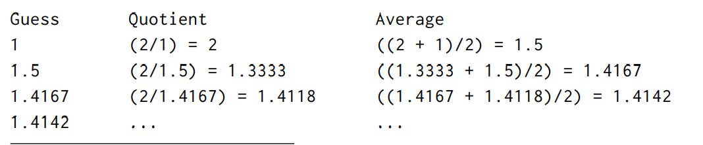
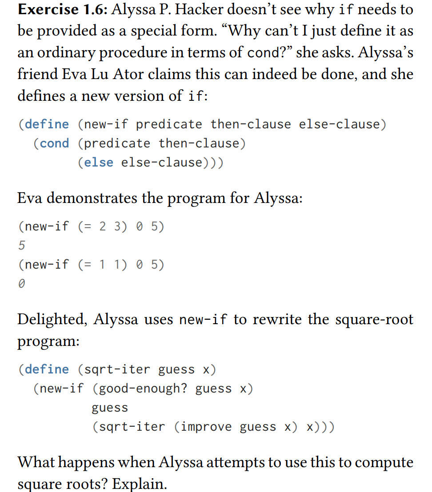

# 1. Building Abstractions with Procedures

### 1.1 Elements of Programming

**All programming languages have:  
  
primitive expressions**  
represent the simplest entities the language is concerned with  
  
**means of combination**  
by which compound elements are built from simpler ones   
  
**means of abstraction**  
 by which compound elements can be named and manipulated as units.  
  
In programming we deal with: **procedures** and **data**  
\(Though they are not as distinct as you would think.\)  
  


### Basics of Lisp

| \(+  | 2.7  | 10\) |
| :---: | :---: | :---: |
| operator | operand | operand |

Lisp's convention of placing operator to the left is called **prefix notation**.

The interpreter always run in the same cycle: **read-eval-print loop.** An expression like `(+ ( 3 (+ ( 2 4) (+ 3 5))) (+ (- 10 7) 6))` which may be hard for humans to parse, easy for the interpreter to answer.


| \(define  | size  | 2\) |
| :---: | :---: | :---: |
|  | variable | value |

The interpreter must maintain some sort of memory that keeps track of the name-object pairs. This memory is called the **environment**. \(eg: global environment\). 


#### Compound Procedures

`(define (square x) (* x x))`

\(define \(⟨name⟩ ⟨formal parameters⟩\) ⟨body⟩\)

  
  
**General form of a conditional:** 

**`(define (abs x) (cond ((< x 0) (- x)) (else x)))`**  
  
****\(cond \(⟨p1⟩ ⟨e1⟩\) \(⟨p2⟩ ⟨e2⟩\) . . . \(⟨pn⟩ ⟨en⟩\)\)

Conditional expressions are evaluated as follows. Predicate ⟨p1⟩ is evaluated first. If its value is false, then ⟨p2⟩ is evaluated. If ⟨p2⟩’s value is also false, then ⟨p3⟩ is evaluated. The process continues until a predicate is found whose value is true, in which case the interpreter returns the value of the corresponding consequent expression ⟨e⟩ of the clause as the value of the conditional expression. If none of the ⟨p⟩’s is found to be true, the value of the cond is undefined.   
  
**Lisp is an applicative order language.**

#### \*\*\*\*

###  Applicative order versus normal order \(aka lazy evaluation\)





Lazy evaluating is when a compiler only evaluates an expression when needed. This can be more efficient, for eg: short circuiting for &&. If the left side evaluates to false, then the right side is not evaluated. You can also work with infinite lists.


**Exercise 1.5**

What's the difference between trying to run the below code in an applicative order vs normal order compiler?

```text
(define (p) (p))
(define (test x y)
    (if (= x 0) 0 y))

(test 0 (p))
```

**Answer:**

In a strict evaluation/ applicative order compiler, the compiler is stuck at line one, which is a recursive function.   
  
In a lazy evaluation/ normal order compiler, since `p` is not needed yet, the compiler does not evaluate the first line. Since the parameter given satisfy the `(= x 0)` clause, '0' is returned as the result without even evaluating `y`.

### 

### Square Roots by Newton’s Method

Difference between mathematics functions and computer procedures: Procedures must be effective.

For eg, the mathematical function for finding the square root of a number can be defined as: **√ x = the y such that y ≥ 0 and y \*\* 2 = x**  
  
It is declarative rather than imperative. The imperative way of finding square root is through Newton’s method of successive approximations by averaging y with x/y.

For square root of 2:



The pseudo-code:

```text
(define (sqrt-of guess x)
    (if (good-enough? guess x)
       guess
       (sqrt-of (improve guess x) x)))
    
```

It recursively improves the guesses until it is good enough, where good enough is defined as the difference between the squared guess and x being 0.001: 

```text
(define (good-enough? guess x)
(< (abs (- (square guess) x)) 0.001))
```

And the guess is improved each time using Newton's method:

```text
(define (improve guess x)
(average guess (/ x guess)))

(define (average x y)
(/ (+ x y) 2))
```






