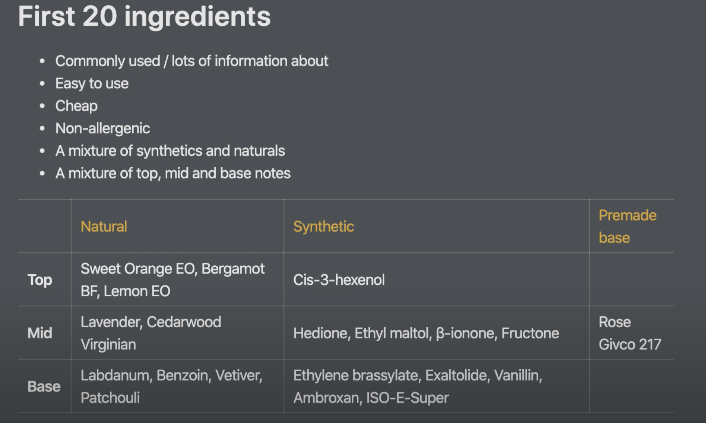

# Perfumery

## Safety guidelines and Lab rules/ tips

Aromachemicals and essential oils are generally not safe to ingest/ touch undiluted

Keep away from warm temperatures, as there are some chemicals that may combust

Room-temp UHT milk to wash out oils \(from ingestion or eyes\)

Use foam-based fire extinguishers for flames

Store in air-tight containers in cool, dry place

Rubber teats are not air-tight







Beginner ingredients:





• Perfumers alcohol \(200 proof - SDA 40-B Ethanol\)

• The "Must haves": 

* [x] Iso E super \(for blending\)
* [x]  Galaxolide \(clean musk\)
* [x]  Hedione \(floral\) \(women's floral perfume\)
* [x] Dipropylene Glycol \(DPG\) for diluting

• Musks, Linalool: 

* [ ] Exaltolide \(skin musk\)
* [x] Ethyl Linalool

• Woods:

* [x] Cedarwood EO \(~~atlas~~ vs virginia\)
* [x] Agarwood \(oud\) - Black Agar accord
* [ ] Sandalwood \(Sandalore/Sandela\) 
* [ ] Pine
* [ ] Juniper Berry EO
* [ ] Patchouli Light EO \(Clearwood\)

• Florals:

* [x] Rose otto/ rose de mai accord
* [ ] Jasmine \(Jasmatone\)
* [x] Iris/violet/orris \(alpha isomethyl ionone, ~~ionone alpha or Methyl Ionone Gamma~~\)
* [x] Lavender EO 
* [x] Orange Blossom \(neroli accord\)

• Citruses 

* [x] Bergamot EO
* [x]  Orange \(Sweet\) 
* [ ] EO Grapefruit \(Pink\) EO

• Fruits 

* [ ] Nectarine/peach \(Nectaryl\) 
* [x] Delta Decalactone \(creamy coconut, or coconut accord\)
* [x] Apple \(Fructone and/or ~~Manzanate~~\)
* [x] Benzyl acetate
* [ ] Pineapple \(pre-made accord\)

• Gourmand

* [x] Dairy accord
* [x] Green tea accord
* [x] Mint EO
* [x] Coffee EO
* [x] Cocoa absolute \(10%\)
* [x] Maple lactone
* [x] Cognac accord
* [x] Tonka Bean \(absolute or pre made accord\)

• Spicy 

* [x] Cardamom EO 
* [x] AllSpice \(replace w spice accord\)
* [ ] Cinnamon \(Cinnamic Aldehyde\) 
* [ ] Pink pepper EO 
* [x] Frankincense EO \(also called Olibanum\) 
* [x] Tobacco Absolute \(5%\)/ accord

• Ambery 

* [x] Cetalox or Ambroxan \(replaced w fixative 505\)
* [x] Amber \(pre-made accord\)

• Aldehydes

* [x]  C12 MNA \(warm ambery\) 
* [ ] C12 Lauric \(soapy fresh\) 
* [x] C10 Decanal \(orange peel\) 
* [x] C16 Strawberry

• Ozonic 

* [x]  Calone \(replaced w ozone\)
* [x] Floral ozone

• Mossy/Earthy/Animalic

* [x] Oakmoss 
* [x] Leather \(Suederal\)

• Sweet 

* [x] Ethyl Maltol
* [x] Vanillin 

• Green

* [ ] Violet leaf/ tomato leaf \(green leaf accord\)
* [x]   Hexenol-3-Cis \(fresh grass\)

• Balsamic

* [x] Benzoin Ollifac 63 \(replaced w accord or resinoid\)

###  Schiff base





| Item | Price | Quantity \(Min. 1\) | Total\* |
| :--- | :--- | :--- | :--- |
| **Ethyl Linalool** SKU: 4LL11499 | $ 0.19 / gram |     | $ 2.80 \* |
| **Hedione** SKU: 3JJ00218 | $ 0.15 / gram |     | $ 2.40 \* |
| **Iso E Super** SKU: 3WY00244 | $ 0.12 / gram |     | $ 2.10 \* |
| **Dipropylene Glycol \(DPG\)** SKU: 0ZW00165 | $ 0.07 / gram |     | $ 3.00 \* |
| **Black Agarwood Artificial** SKU: 6WU07708 | $ 1.12 / gram |     | $ 6.50 \* |
| **Cedarwood Virginian Essential Oil** SKU: 7WW00095 | $ 0.21 / gram |     | $ 2.58 \* |
| **Lavender Essential Oil** SKU: 7HL00267 | $ 0.37 / gram |     | $ 2.75 \* |
| **Neroli Fleuressence** SKU: 6CN09093 | $ 0.31 / gram |     | $ 2.45 \* |
| **Alpha Isomethyl Ionone** SKU: 3IW00300 | $ 0.23 / gram |     | $ 2.05 \* |
| **Rose de Mai Fleuressence** SKU: 6RM09423 | $ 0.32 / gram |     | $ 2.50 \* |
| **Mandarin Essential Oil** SKU: 7CA00285 | $ 0.30 / gram |     | $ 2.40 \* |
| **Bergamot Essential Oil** SKU: 7CL00061 | $ 0.46 / gram |     | $ 3.20 \* |
| **Fructone B** SKU: 3FG00196 | $ 0.14 / gram |     | $ 2.30 \* |
| **Benzyl Acetate** SKU: 3JF00052 | $ 0.20 / gram |     | $ 2.90 \* |
| **Galaxolide 50 DEP** SKU: 3XA00199 | $ 0.10 / gram |     | $ 2.40 \* |
| **Floral Ozone** SKU: 4YM00191 | $ 0.22 / gram |     | $ 2.00 \* |
| **Vanillin** SKU: 1VW00456 | $ 0.19 / gram |     | $ 2.80 \* |
| **Myrac Aldehyde** SKU: 4MA00312 | $ 0.14 / gram |     | $ 2.30 \* |
| **Fixative 505 10% in DPG** SKU: 5UY07860 | $ 0.22 / gram |     | $ 3.10 \* |
| **Aldehyde C-10 Decanal** SKU: 4AC00018 | $ 0.17 / gram |     | $ 2.60 \* |
| **Aldehyde C-12 MNA** SKU: 4AG00022 | $ 0.28 / gram |     | $ 3.70 \* |
| **Aldehyde C-16 Ethyl Methyl Phenyl Glycidate** SKU: 4FC00176 | $ 0.14 / gram |     | $ 2.30 \* |
| **Tobacco Fleuressence** SKU: 6TW08328 | $ 0.24 / gram |     | $ 2.82 \* |
| **Coumarin** SKU: 1VD00129 | $ 0.16 / gram |     | $ 2.50 \* |
| **Cardamom Essential Oil 10% in DPG** SKU: 5SC07859 | $ 0.42 / gram |     | $ 3.00 \* |
| **S-Spice Fleuressence** SKU: 6SP12451 | $ 0.22 / gram |     | $ 3.10 \* |
| **Frankincense Fleuressence** SKU: 6QC09083 | $ 0.46 / gram |     | $ 3.20 \* |
| **Oakmoss Resinoid \(IFRA Low Atranol\) 50% in DPG** SKU: 5YQ11150 | $ 0.24 / gram |     | $ 3.30 \* |

