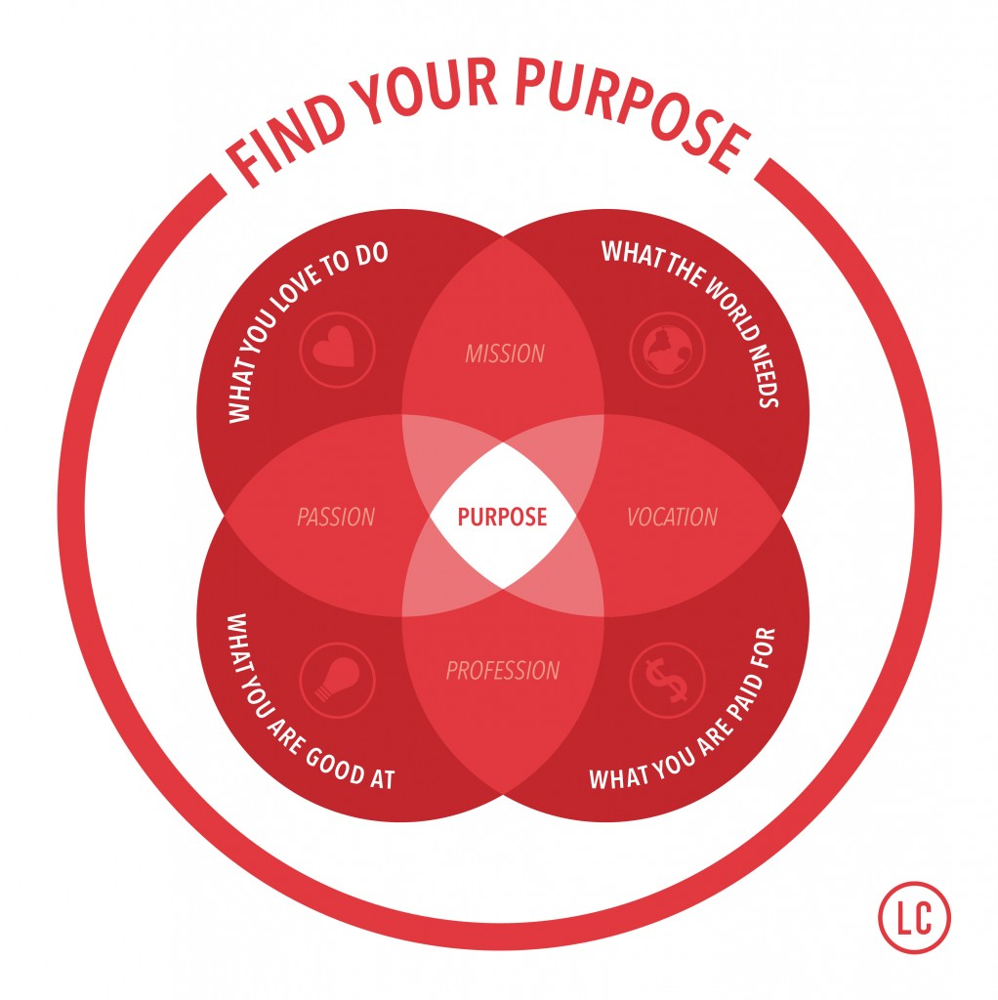

# How to choose a career

## Axioms

1. You develop [passion ](https://bigthink.com/mike-colagrossi/why-following-your-passion-could-leave-you-broke-and-frustrated)for a subject often after you get good at it. 
2. Financial security is essential for most people to be happy. \(It also tends to be [relative](https://www.cnbc.com/2017/11/20/how-much-money-you-need-to-be-happy-according-to-wealth-experts.html).\)
3. [Meaningful jobs](https://www.psychologicalscience.org/news/minds-business/a-meaningful-job-linked-to-higher-income-and-a-longer-life.html) tend to be [social](https://www.realsimple.com/work-life/life-strategies/job-career/meaningful-work), with high positive impact, fair rewards and [autonomy](https://open.buffer.com/meaningful-work/).

## Ikigai

The Japanese concept '[Ikigai](https://medium.com/thrive-global/ikigai-the-japanese-secret-to-a-long-and-happy-life-might-just-help-you-live-a-more-fulfilling-9871d01992b7)' refers to "a reason for being."

## Other Resources

* [waitbutwhy's comic](https://waitbutwhy.com/2018/04/picking-career.html)
* [80000 hours](https://80000hours.org/career-guide/) \(based on the idea that you spend at least 80000 hours working on average.\)

