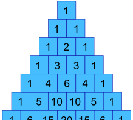

# Hackerrank 10 days of Statistics

## Day 0

### Mean, Median, Mode

Mean: Average of the set. If the set = \[2, 4, 5\], then the average is \(2+4+5\)/3.

Median: Midpoint value of a data set, where a equal number of samples is _less than_ and _greater than_ the value. If the set = \[1, 3, 4, 5, 9\], then the median is 4.

Mode: Element\(s\) that occur most frequently in a data set. If the set is \[1, 3, 3, 3, 4, 6, 7, 7, 9\], then the mode is 3.

### Precision & Scale

Precision: Number of significant digits. \(eg: 0.012345 and 12.345 have a precision of 5\)

Scale: Number of significant digits to the right of a decimal point. \(eg: 0.12 and 1.23 both have a scale of 2\)

## Day 1

### Standard Deviation

To calculate the Variance, take each difference, square it, and then average the result:

| **Variance** |  |  |
| :--- | :--- | :--- |
| σ2 | = | _2062 + 762 + \(−224\)2 + 362 + \(−94\)2_**5** |
|  | = | _42436 + 5776 + 50176 + 1296 + 8836_**5** |
|  | = | _108520_**5** |
|  | = | 21704 |

So the Variance is **21,704**

And the Standard Deviation is just the square root of Variance, so:

| **Standard Deviation** |  |  |
| :--- | :--- | :--- |
| σ | = | √21704 |
|  | = | 147.32... |
|  | = | **147** \(to the nearest mm\) |


Why square? 

[https://www.mathsisfun.com/data/standard-deviation.html\#WhySquare](https://www.mathsisfun.com/data/standard-deviation.html#WhySquare)


## Day 2

### Probability

Probability of an event happening = _Number of ways it can happen /_ Total number of outcomes



### Permutations

### Combinations

## Day 3

### [Conditional Probability](https://en.wikipedia.org/wiki/Conditional_probability)

This is defined as the probability of an event occurring, assuming that one or more other events have already occurred.

Resource: [https://www.mathsisfun.com/data/probability-events-conditional.html](https://www.mathsisfun.com/data/probability-events-conditional.html)

Probability of **event A and event B** equals the probability of **event A** times the probability of **event B given event A:**

The probability of **event B given event A** equals the probability of **event A and event B** divided by the probability of **event A:**

### Bayes Theorem



## Day 4

### Binomial Distribution

Formula: n! / \(k!\(n-k\)!

Assumption: the chances of success or failure are **equally likely**.

### Geometric Distribution

Geometric probability distribution” basically means the multiplication of probabilitie



#### Cumulative geometric probability distribution



Formula: p \* \(\(1-p\) \*\* k-1\)

## Day 5

### Poisson Distribution



The **Poisson distribution** is the [discrete probability distribution](https://brilliant.org/wiki/discrete-random-variables-definition/) of the number of events occurring in a given time period, given the average number of times the event occurs over that time period.

**Conditions for Poisson Distribution:**

* An event can occur any number of times during a time period.
* Events occur independently.
* The rate of occurrence is constant.
* The probability of an event occurring is proportional to the length of the time period.



### Waiting Time

Using Poisson process to figure out how long we have to wait until the next event \(this is sometimes called the interarrival time\):




Note to self: Still not too sure how to derive Poisson Distribution's formula


## Day 6

### Central Limit Theorem 

CLT is a statistical theory that states that given a sufficiently large sample size from a population with a finite level of variance, the mean of all samples from the same population will be about equal to the mean of the population.

All the samples will follow an approximate [normal distribution](https://www.investopedia.com/terms/n/normaldistribution.asp) pattern, with all variances being about equal to the [variance](https://www.investopedia.com/terms/v/variance.asp) of the population divided by each sample's size.

## Day 7

### Covariance

“Covariance” indicates the direction of the linear relationship between variables. “Correlation” on the other hand measures both the strength and direction of the linear relationship between two variables.



Covariance =&gt; Correlation: divide the covariance values by the standard deviation, it essentially scales the value down to a limited range of **-1 to +1,** ie:

* **ρ\(X,Y\)** – the correlation between the variables X and Y
* **Cov\(X,Y\)** – the covariance between the variables X and Y
* **σX** – the standard deviation of the X-variable
* **σY** – the standard deviation of the Y-variable

* **Xi** – the values of the X-variable
* **Yj** – the values of the Y-variable
* **X̄** – the mean \(average\) of the X-variable
* **Ȳ** – the mean \(average\) of the Y-variable
* **n** – the number of the data points





