# ADVANCED EC2

## Bootstrapping EC2 using User Data

userdata is metadata url, but last part is user-data

ec2 does not validate user data

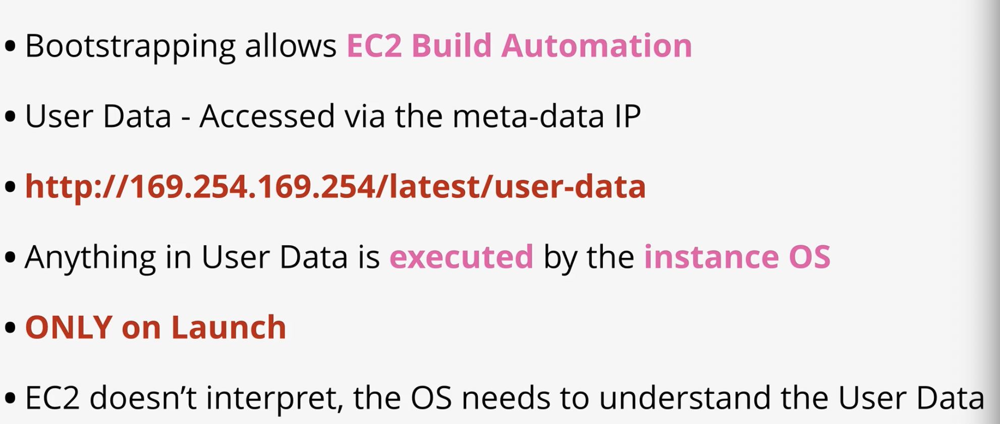

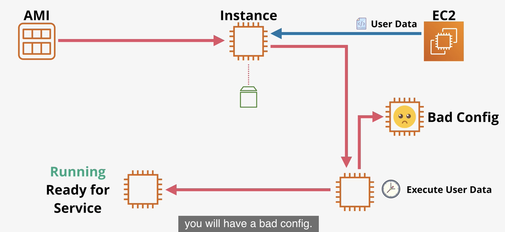

Don't use for credentials

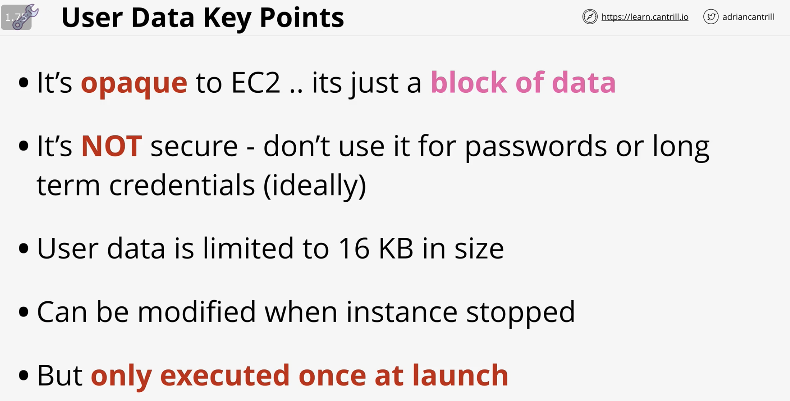

### Boot time to service time

reduces post launch time

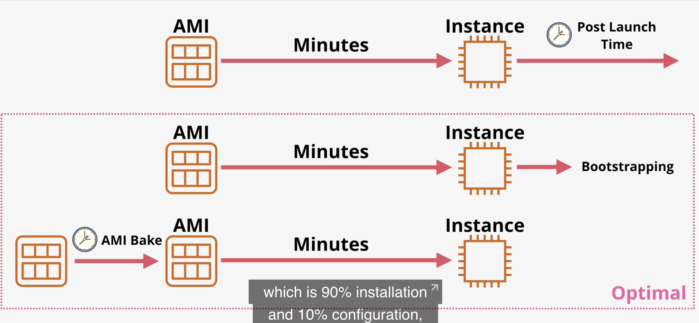

Good practice, AMI bake in the time intensive parts, like installation, and bootstrap final config \(combine both\)

Demo: [https://learn.cantrill.io/courses/730712/lectures/14679964](https://learn.cantrill.io/courses/730712/lectures/14679964)

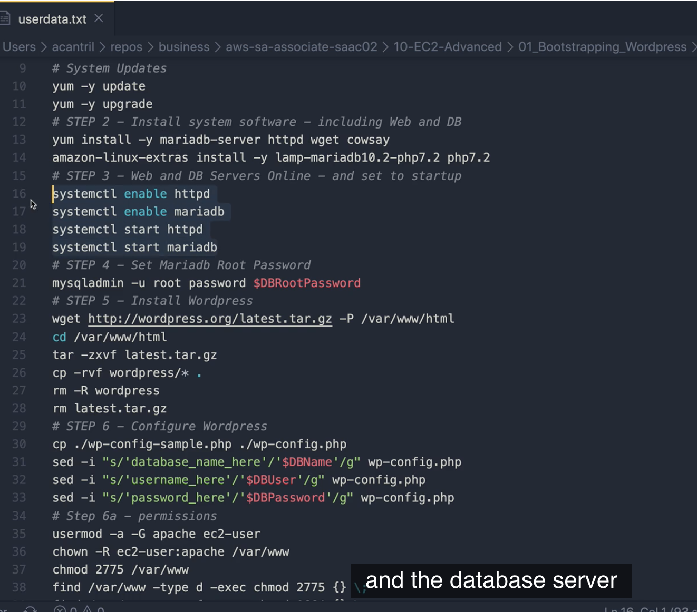

commands that were manually entered previously

* launch instance with ami
* in configure instance &gt; advanced details: copy and paste user data
* ec2 instance connect \`curl [http://169.254.169.254/latest/user-data](http://169.254.169.254/latest/user-data)\`
* see log files `cd /var/log`
* `cat cloud-init-output.log`

 Cloudformation:

`Fn::Base64` to encode plaintext, unless using GUI

* create stack, choose template
* fill up parameters

## AWS::CloudFormation::Init

cfn-init uses desired state

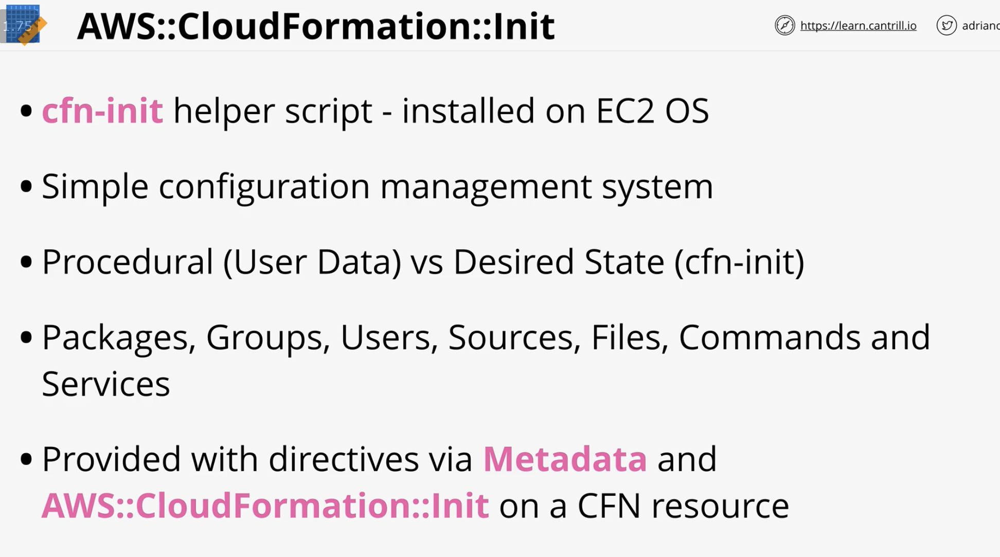

cfn-init can watch for updates to metadata

user-data has a problem, if config fails, you don't know because instance creation is successful

that's what creationpolicy is for

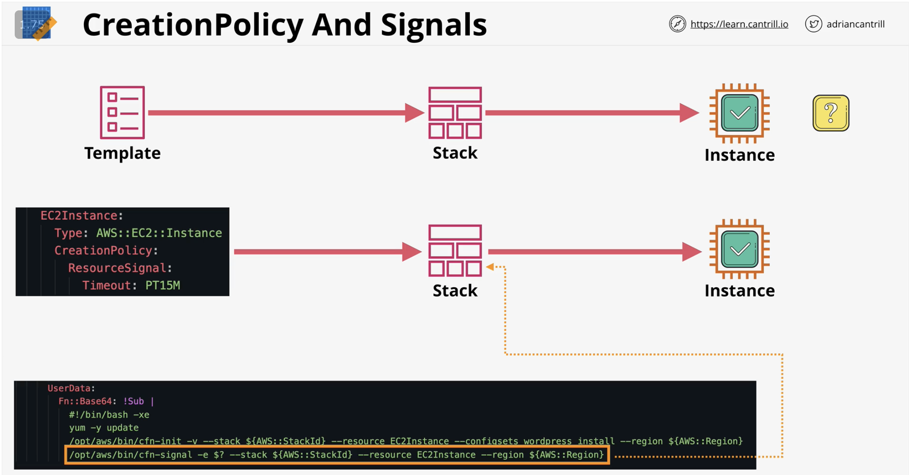

Demo: [https://learn.cantrill.io/courses/730712/lectures/14679975](https://learn.cantrill.io/courses/730712/lectures/14679975)

## EC2 instance roles

Instance profile is a wrapper around IAM role so that EC2 instance can assume it

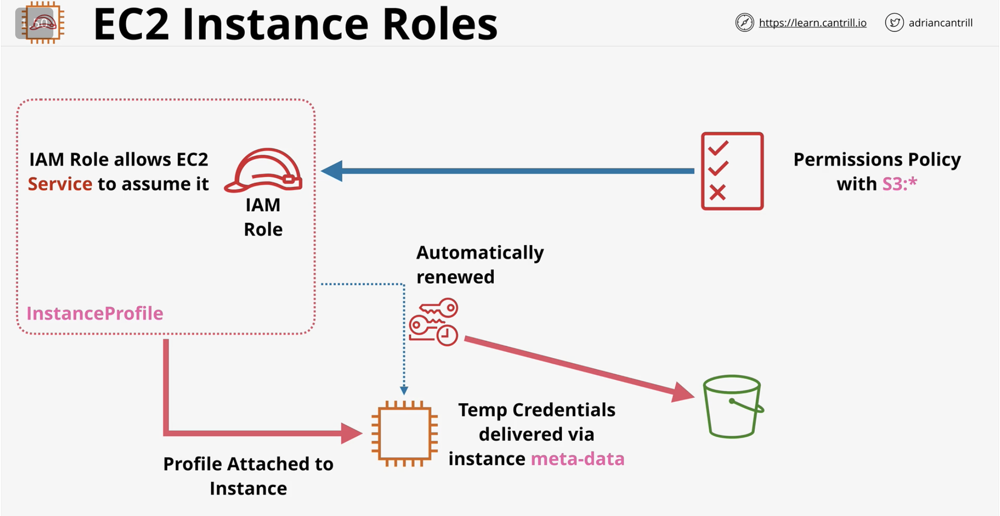

app keeps checking metadata for iam role creds

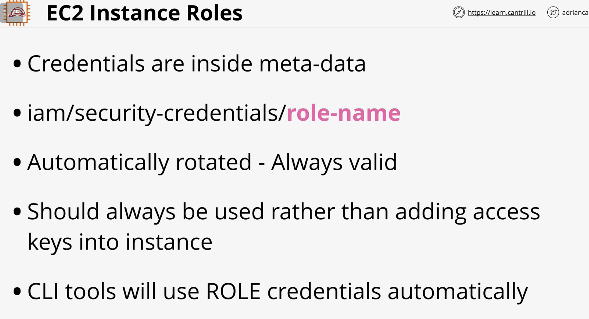

Demo: [https://learn.cantrill.io/courses/730712/lectures/14679978](https://learn.cantrill.io/courses/730712/lectures/14679978)

[1-Click Deployment](https://console.aws.amazon.com/cloudformation/home?region=us-east-1#/stacks/create/review?templateURL=https://learn-cantrill-labs.s3.amazonaws.com/awscoursedemos/0011-aws-associate-ec2-instance-role/A4L_VPC_PUBLICINSTANCE_ROLEDEMO.yaml&stackName=IAMROLEDEMO)

[Lesson Commands](https://learn-cantrill-labs.s3.amazonaws.com/awscoursedemos/0011-aws-associate-ec2-instance-role/lesson_commands.txt)

[Credential Precedence](https://docs.aws.amazon.com/cli/latest/userguide/cli-configure-quickstart.html#cli-configure-quickstart-precedence)

* EC2, ec2 instance connect to instance
* `aws s3 ls` will say unable to locate creds
* config instance role by going to iam to create iam role first
* create role -&gt; aws service -&gt; select amazons3ReadOnlyAccess -&gt; create role
* go back to ec2 -&gt; right click instance, security, modify iam role, select role, attach it
* ec2 instance connect with ec2-user and `aws s3 ls`
* then you'll see that it works
* `curl http://169.254.169.254/latest/meta-data/iam/security-credentials` will show role attached
* you can see the creds and exp below:

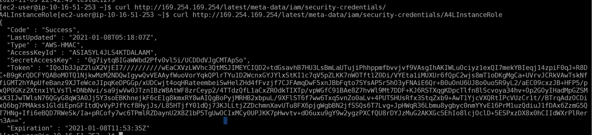

there's a credential precedence for cli:

1. command line options
2. env var
3. CLI cred file
4. CLI config file
5. Container cred
6. Instance profile cred

## AWS System Manager Parameter Store

Parameter store allows you to store config and secrets

using string, stringlist, securestring

has versioning of params

integrates w aws services like ec2

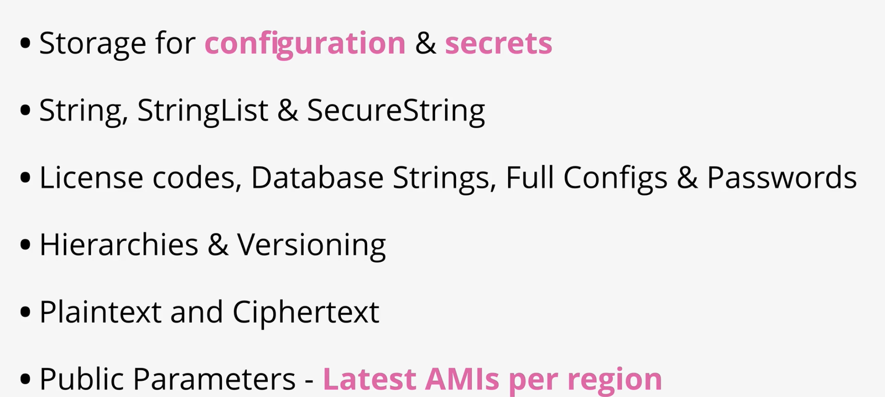

It's a public service, so service accessing it needs to be able to access aws public network

interfaces with IAM

can store heirachies

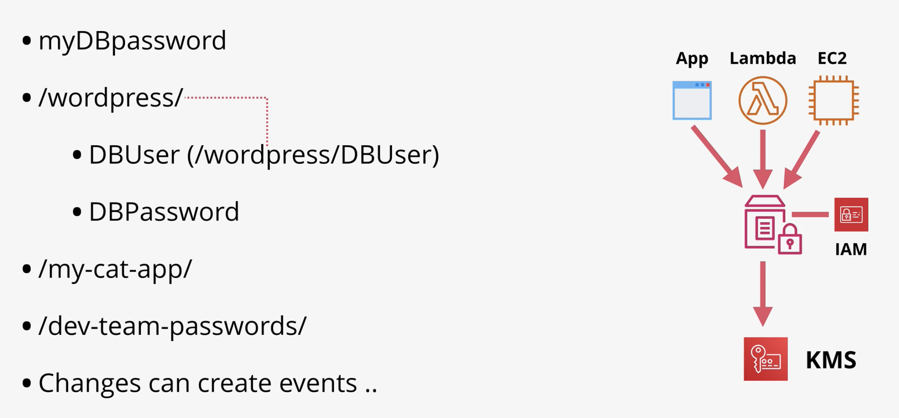

Demo: [https://learn.cantrill.io/courses/730712/lectures/14726913](https://learn.cantrill.io/courses/730712/lectures/14726913)

[lesson commands](https://github.com/acantril/aws-sa-associate-saac02/blob/master/10-EC2-Advanced/04_SSMParameter_Store/lesson_commands.txt)

* go to system manager &gt; parameter store
* create parameter \(standard 10k params, advanced &gt; 10k, charges apply\)
* first param name `/my-cat-app/dbstring` where it's a hierachy due to `/` and `my-cat-app` is folder, and value is {value}
* second is `/my-cat-app/dbuser`
* third is `/my-cat-app/dbpassword` which is SecureString, choose KMS key source, use default
* use CloudShell \(uses creds of current acct\)
* `aws ssm get-parameters --name /my-cat-app/dbstring`
* will give you a json of the param
*  you can also use get param by path
* `aws ssm get-parameers-by=path --path /my-cat-app/`
* to decrypt param, you need to have access to the kms used to encrypt it \(ie: use same acct\)
* `aws ssm get-parameters-by-path --path /my-cat-app/ -- with-decryption`

## System and Application Logging on EC2

you may want to enable monitoring inside instance, like app and system logs, etc

 cloudwatch cannot capture data inside an instance unless you use cloudwatch agent configured

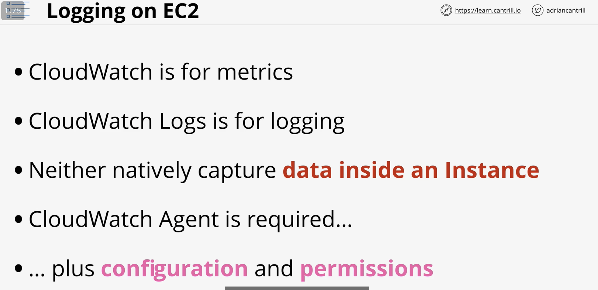

say you have a wordpress app instance, you need to install cloudwatch agent in it, have config so agent knows what to do. use iam role to let cloudwatch service to access ec2 instance.

config needs to set up log group, log stream inside log group for each instance

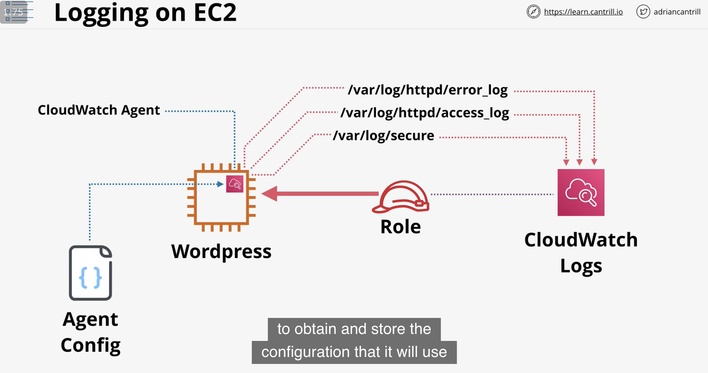

you can store agent config in parameter store

Demo: [https://learn.cantrill.io/courses/730712/lectures/14727081](https://learn.cantrill.io/courses/730712/lectures/14727081)

In this \[DEMO\] lesson you will download and install the CloudWatch Agent and configure it to capture 3 log files from an EC2 instance

* /var/log/secure
* /var/log/httpd/access\_log
* /var/log/httpd/error\_log

You will also configure an instance role allowing the agent to store the above config into parameter store AND allow the agent to inject the logging and metric data into CW and CW Logs.

[1-Click Deployment](https://console.aws.amazon.com/cloudformation/home?region=us-east-1#/stacks/create/review?templateURL=https://learn-cantrill-labs.s3.amazonaws.com/awscoursedemos/0013-aws-associate-ec2-cwagent/A4L_VPC_PUBLIC_Wordpress.yaml&stackName=CWAGENT)

[Lesson Commands](https://learn-cantrill-labs.s3.amazonaws.com/awscoursedemos/0013-aws-associate-ec2-cwagent/lesson_commands.txt)

