# ADVANCED EC2

## Bootstrapping EC2 using User Data

userdata is metadata url, but last part is user-data

ec2 does not validate user data

Don't use for credentials

### Boot time to service time

reduces post launch time

Good practice, AMI bake in the time intensive parts, like installation, and bootstrap final config \(combine both\)

Demo: [https://learn.cantrill.io/courses/730712/lectures/14679964](https://learn.cantrill.io/courses/730712/lectures/14679964)

commands that were manually entered previously

* launch instance with ami
* in configure instance &gt; advanced details: copy and paste user data
* ec2 instance connect \`curl [http://169.254.169.254/latest/user-data](http://169.254.169.254/latest/user-data)\`
* see log files `cd /var/log`
* `cat cloud-init-output.log`

 Cloudformation:

`Fn::Base64` to encode plaintext, unless using GUI

* create stack, choose template
* fill up parameters

## AWS::CloudFormation::Init

cfn-init uses desired state

cfn-init can watch for updates to metadata

user-data has a problem, if config fails, you don't know because instance creation is successful

that's what creationpolicy is for

Demo: [https://learn.cantrill.io/courses/730712/lectures/14679975](https://learn.cantrill.io/courses/730712/lectures/14679975)

## EC2 instance roles

Instance profile is a wrapper around IAM role so that EC2 instance can assume it

app keeps checking metadata for iam role creds

Demo: [https://learn.cantrill.io/courses/730712/lectures/14679978](https://learn.cantrill.io/courses/730712/lectures/14679978)

[1-Click Deployment](https://console.aws.amazon.com/cloudformation/home?region=us-east-1#/stacks/create/review?templateURL=https://learn-cantrill-labs.s3.amazonaws.com/awscoursedemos/0011-aws-associate-ec2-instance-role/A4L_VPC_PUBLICINSTANCE_ROLEDEMO.yaml&stackName=IAMROLEDEMO)

[Lesson Commands](https://learn-cantrill-labs.s3.amazonaws.com/awscoursedemos/0011-aws-associate-ec2-instance-role/lesson_commands.txt)

[Credential Precedence](https://docs.aws.amazon.com/cli/latest/userguide/cli-configure-quickstart.html#cli-configure-quickstart-precedence)

* EC2, ec2 instance connect to instance
* `aws s3 ls` will say unable to locate creds
* config instance role by going to iam to create iam role first
* create role -&gt; aws service -&gt; select amazons3ReadOnlyAccess -&gt; create role
* go back to ec2 -&gt; right click instance, security, modify iam role, select role, attach it
* ec2 instance connect with ec2-user and `aws s3 ls`
* then you'll see that it works
* `curl http://169.254.169.254/latest/meta-data/iam/security-credentials` will show role attached
* you can see the creds and exp below:

there's a credential precedence for cli:

1. command line options
2. env var
3. CLI cred file
4. CLI config file
5. Container cred
6. Instance profile cred

## AWS System Manager Parameter Store

Parameter store allows you to store config and secrets

using string, stringlist, securestring

has versioning of params

integrates w aws services like ec2

It's a public service, so service accessing it needs to be able to access aws public network

interfaces with IAM

can store heirachies

Demo: [https://learn.cantrill.io/courses/730712/lectures/14726913](https://learn.cantrill.io/courses/730712/lectures/14726913)

[lesson commands](https://github.com/acantril/aws-sa-associate-saac02/blob/master/10-EC2-Advanced/04_SSMParameter_Store/lesson_commands.txt)

* go to system manager &gt; parameter store
* create parameter \(standard 10k params, advanced &gt; 10k, charges apply\)
* first param name `/my-cat-app/dbstring` where it's a hierachy due to `/` and `my-cat-app` is folder, and value is {value}
* second is `/my-cat-app/dbuser`
* third is `/my-cat-app/dbpassword` which is SecureString, choose KMS key source, use default
* use CloudShell \(uses creds of current acct\)
* `aws ssm get-parameters --name /my-cat-app/dbstring`
* will give you a json of the param
*  you can also use get param by path
* `aws ssm get-parameers-by=path --path /my-cat-app/`
* to decrypt param, you need to have access to the kms used to encrypt it \(ie: use same acct\)
* `aws ssm get-parameters-by-path --path /my-cat-app/ -- with-decryption`

## System and Application Logging on EC2

you may want to enable monitoring inside instance, like app and system logs, etc

 cloudwatch cannot capture data inside an instance unless you use cloudwatch agent configured

say you have a wordpress app instance, you need to install cloudwatch agent in it, have config so agent knows what to do. use iam role to let cloudwatch service to access ec2 instance.

config needs to set up log group, log stream inside log group for each instance

you can store agent config in parameter store

Demo: [https://learn.cantrill.io/courses/730712/lectures/14727081](https://learn.cantrill.io/courses/730712/lectures/14727081)

In this \[DEMO\] lesson you will download and install the CloudWatch Agent and configure it to capture 3 log files from an EC2 instance

* /var/log/secure
* /var/log/httpd/access\_log
* /var/log/httpd/error\_log

You will also configure an instance role allowing the agent to store the above config into parameter store AND allow the agent to inject the logging and metric data into CW and CW Logs.

[1-Click Deployment](https://console.aws.amazon.com/cloudformation/home?region=us-east-1#/stacks/create/review?templateURL=https://learn-cantrill-labs.s3.amazonaws.com/awscoursedemos/0013-aws-associate-ec2-cwagent/A4L_VPC_PUBLIC_Wordpress.yaml&stackName=CWAGENT)

[Lesson Commands](https://learn-cantrill-labs.s3.amazonaws.com/awscoursedemos/0013-aws-associate-ec2-cwagent/lesson_commands.txt)

* go to EC2, select instance, ec2 instance connect to it
* download the agent `wget https://s3.amazonaws.com/amazoncloudwatch-agent/amazon_linux/amd64/latest/amazon-cloudwatch-agent.rpm`
*  install the agent: `sudo rpm -U ./amazon-cloudwatch-agent.rpm`
* go back to IAM role, create role for EC2, attach CloudWatchAgentServerPolicy and AmazonSSMFullAccess
* call role CloudWatchRole and create role
* go back to EC2 instance, right click to modify IAM role, select CloudWatchRole from dropdown and save
* connect to ec2 instance again
* start to wizard for cloudwatch agent `sudo /opt/aws/amazon-cloudwatch-agent/bin/amazon-cloudwatch-agent-config-wizard`
* choose default for most except:
*  default metrics config \(choose advanced\) so it captures additional os metrics
* log file path: `/var/log/secure`
* log group name: `/var/log/secure` \(prefer full path\)
* log stream is named after instance generating the log
* yes for additional log file
* log file path \(for additional log files\): `/var/log/httpd/access_log`
* log group name: `/var/log/httpd/access_log`
* yes for additional log file
* log file path \(for additional log files\): `/var/log/httpd/error_log`
* log group name: `/var/log/httpd/error_log`
*  no for additional log file
* do you want to store the config in the SSM parameter store: yes
* param name is `AmazonCloudWatch`-etc by default
* default region is based on meta data \(parameter store is a regional service\)
* finish config
* if you go to param store, you will find cloudwatch config
* you can use this type of architecture to deploy at scale \(since you can copy and paste the config\)
* cloudwatch agent expects the directory collectd
* create the directory `sudo mkdir -p /usr/share/collectd/`
* create db file that agent expects `sudo touch /usr/share/collectd/types.db`
* start the agent with config by:
* `sudo /opt/aws/amazon-cloudwatch-agent/bin/amazon-cloudwatch-agent-ctl -a fetch-config m ec2 -c ssm:AmazonCloudWatch-linux -s`
* the above command starts the agent, pull config from param store, start collecting logs, inject into cloudwatch
* go back to cloudwatch, you should see the logs
* go into /log/secure, you should be able to see ssh connection attempts
* go to metrics &gt; cwagent &gt; image id, instanceid, instance type, name: you should see the diskio metrics
* if you select imageid... cpu, you should see cpu usage logs

## EC2 Placement Groups

by default, aws will place ec2 instances within a region based on availability

placement groups allows you to configure that.

In this lesson we step through the architecture, benefits and limitations of the three placement groups available within AWS :

* Cluster Placement Groups \(PERFORMANCE\)
* Spread Placement Groups \(Resilience\)
* Partition Placement Groups \(Topology Awareness\)



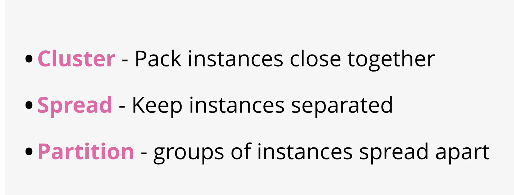

### Why cluster: highest level of performance

best practice is launch at the same time. you might have capacity issue if you launch in batches, eg: you want to double your no of instances but aws only have limited capacity

locked in AZ, same rack, sometimes same host, 10gbps single stream

you need instances that has capacity for streaming 10gbps \(high throughput\)

if hardware in that rack fails, everything fails \(DATA MUST NOT BE CRITICAL\)

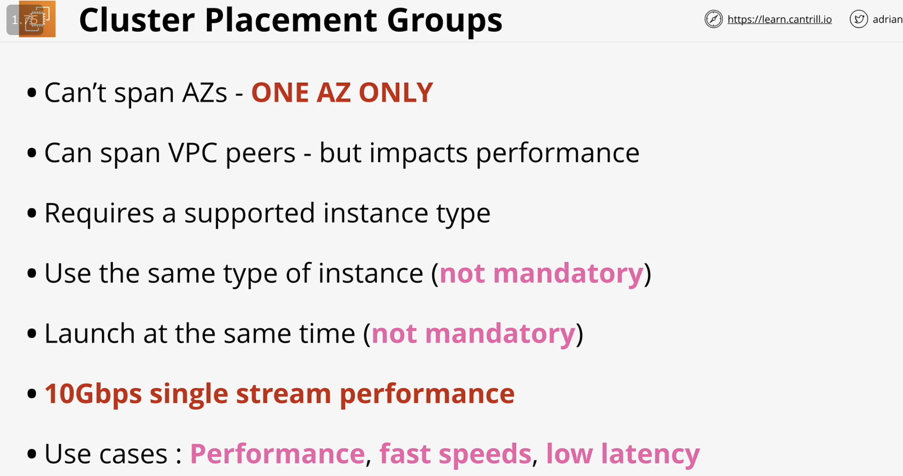

### Why spread placement: resilient

they are placed in diff racks, in diff az, limit of 7 instances per az

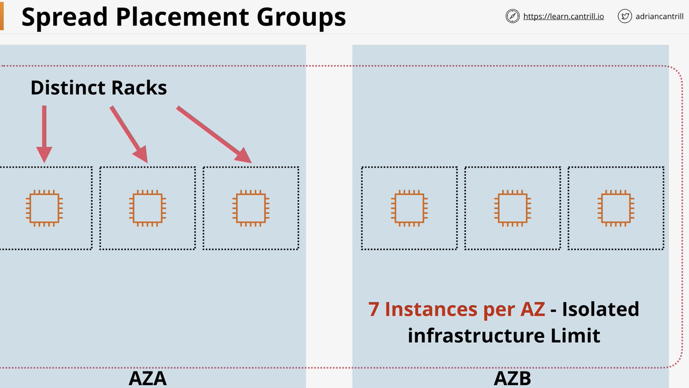

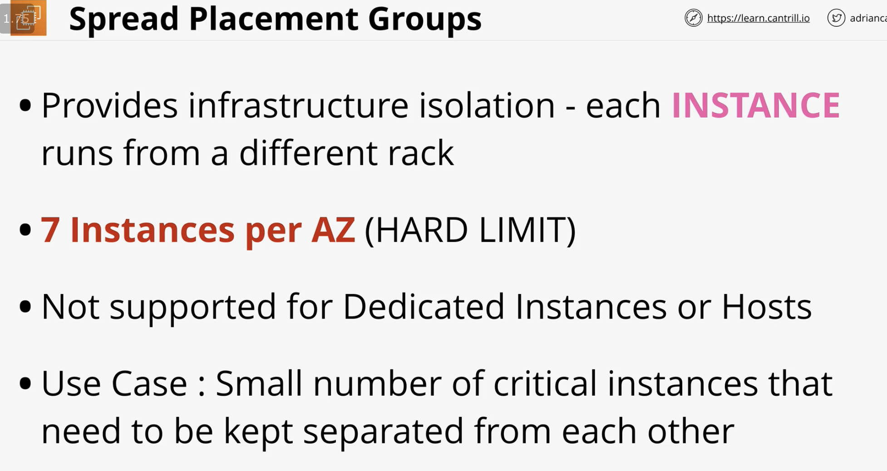

eg: mirrors of app, nodes for analytics cluster

### Why Partition Placement: more than 7 instances in one AZ \(huge scale\)

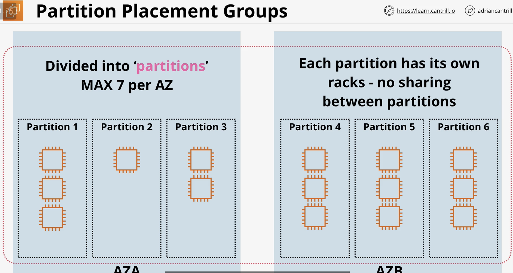

max 7 partitions per AZ, each partition has its own racks, no sharing between partition

you can assign which partition or let aws decide

good for topology aware systems

* Cluster Placement Groups \(PERFORMANCE\)
* Spread Placement Groups \(Resilience\)
* Partition Placement Groups \(Topology Awareness\)



Demo: [https://learn.cantrill.io/courses/730712/lectures/14730107](https://learn.cantrill.io/courses/730712/lectures/14730107)

* go to ec2 -&gt; placement groups -&gt; strategy: cluster \(name: performance\)
* strategy: 'spread' for resilient
* strategy: partition for parallel
* create ec2 instance, in config, placement group: select placement group partition
* target partion: you can let aws aut distribution, or select target partition

## EC Dedicated Hosts \(use if software licensing\)

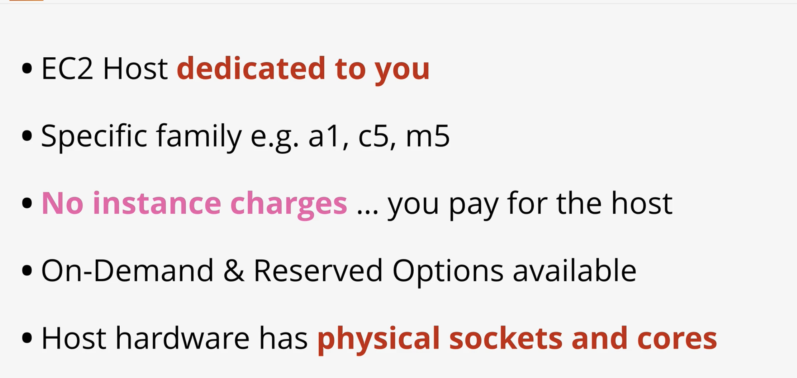

important: software license can utilize visibility of hardware

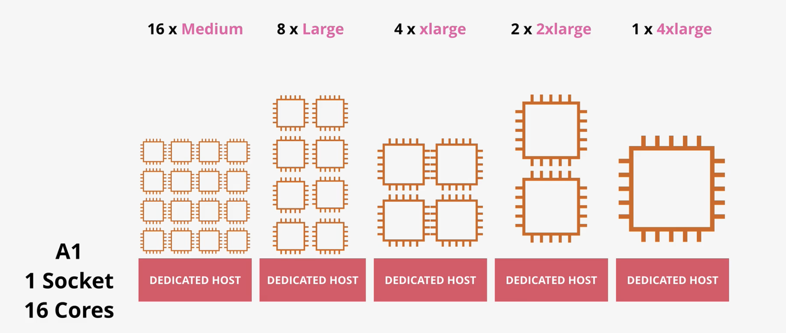

you can't mix and match sizes

unless you use nitro

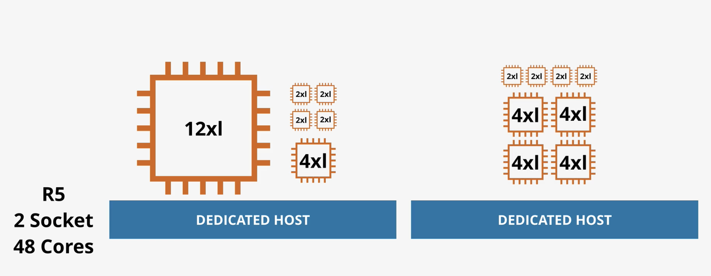

Dedicated hosts are EC2 Hosts which support a certain type of instance which are dedicated to your account.

You can pay an on-demand or reserved price for the hosts and then you have no EC2 instance pricing to pay for instances running on these dedicated hosts.

Generally dedicated hosts are used for applications which use physical core/socket licensing



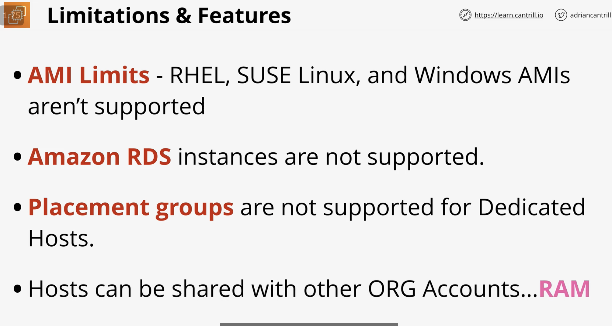

Resource Access Manager \(between accounts\)

## Enhanced Networking & EBS Optimized

Enhanced networking is the AWS implementation of SR-IOV, a standard allowing a physical host network card to present many logical devices which can be directly utilized by instances.

This means lower host CPU usage, better throughput, lower and consistent latency

EBS optimisation on instances means dedicated bandwidth for storage networking - separate from data networking.



instead of host dealing with instances which are virtualizations, enhanced networking has 'logical' cards for the physical network card, exclusive to instance, which handles networking w/o consuming massive cpu

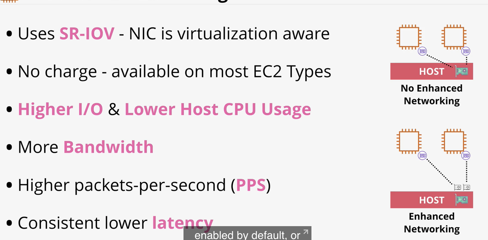

### EBS Optimization:

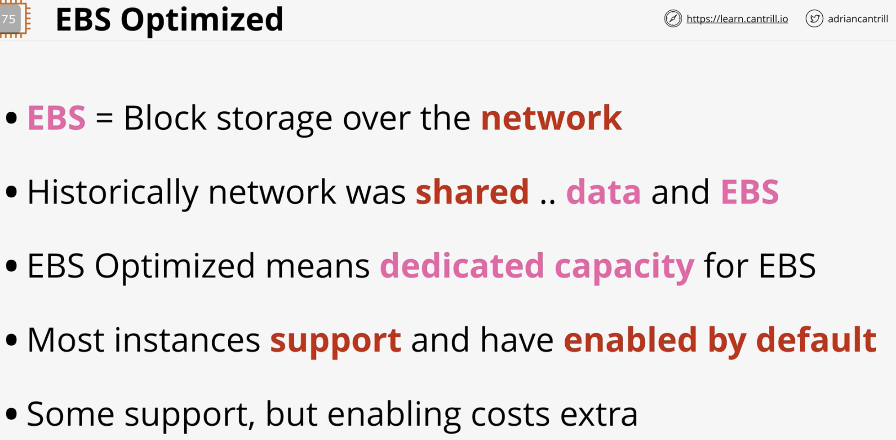

