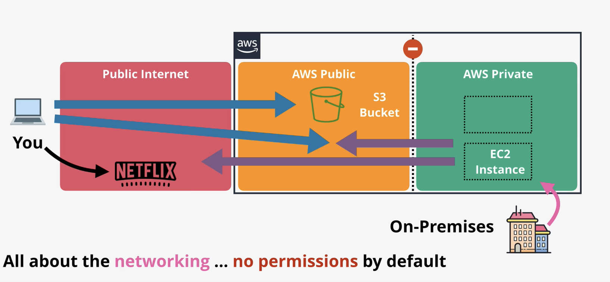
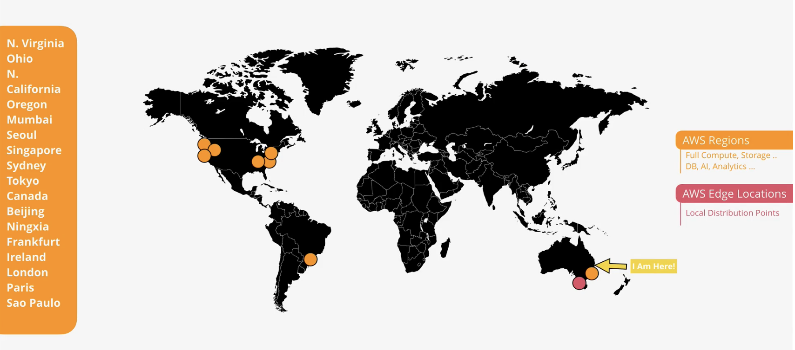
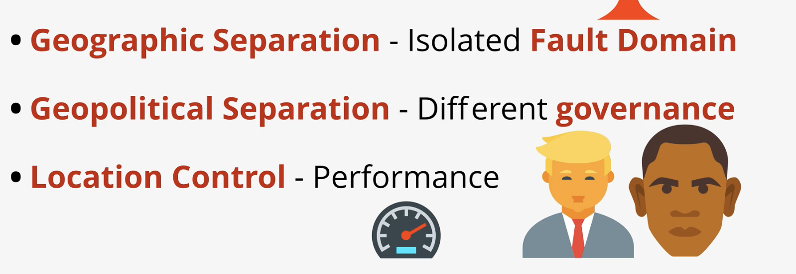
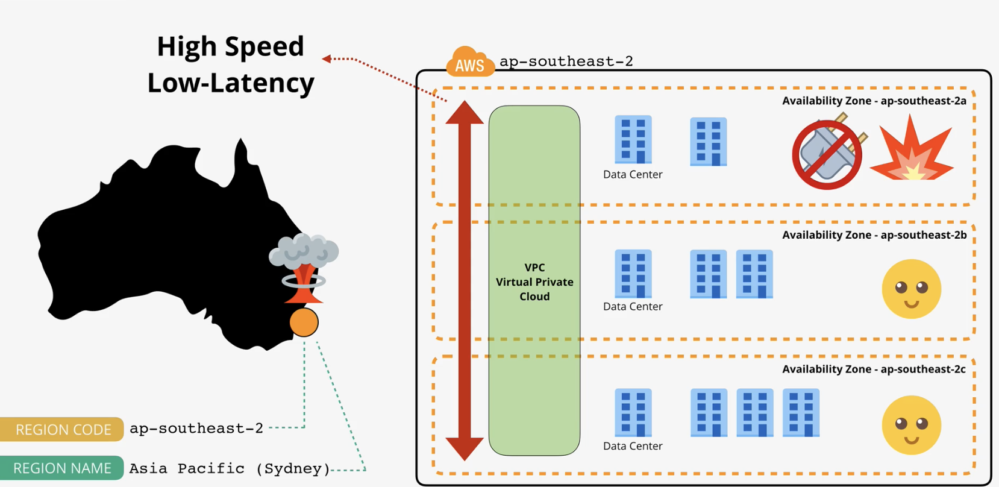
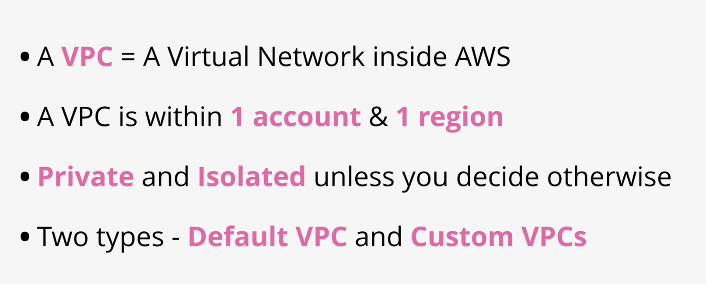
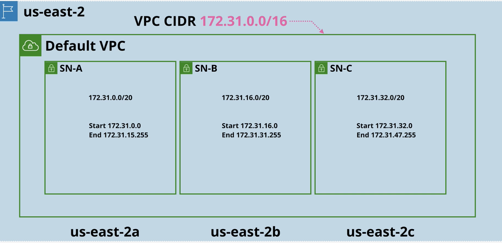
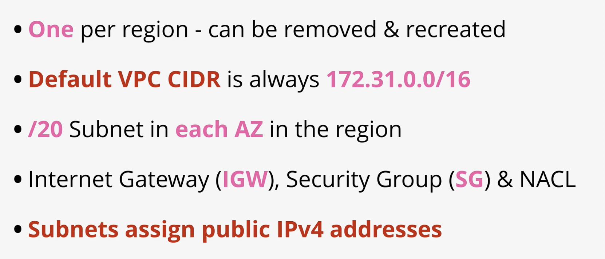
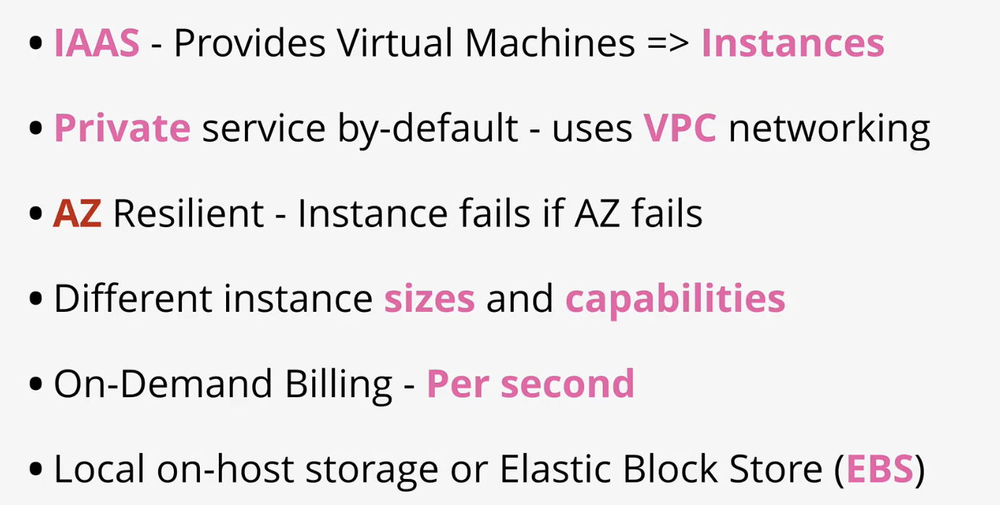
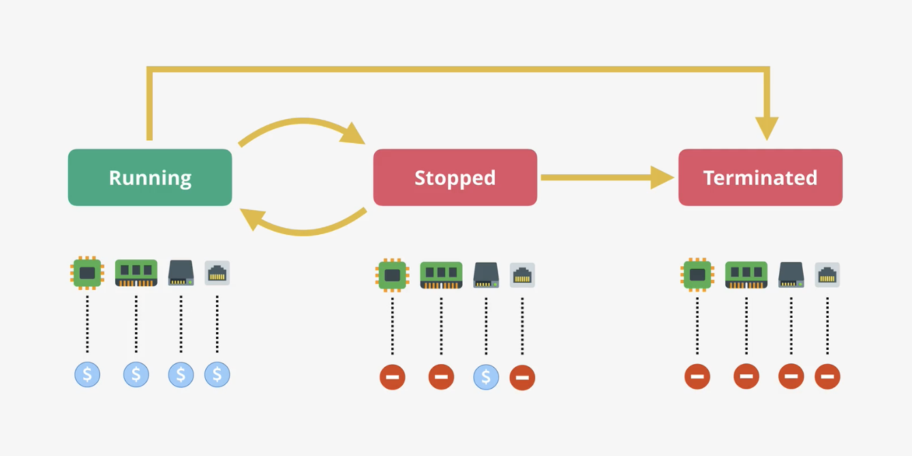

# AWS Fundamentals

### Public VS Private Service

It's all about networking, no permissions by default \(ie: login\)

Private services like EC2 can be accessed by public network by 'pushing' part of it to aws public network.

### Global network

Edge locations are more specific, preferred for low latency needs



### VPC

A **default VPC is created once per region \(only 1 per region\)** when an AWS account is first created.

There can only be one default VPC per region, and they can be deleted and recreated from the console UI .

Default VPC is always configured the same

They always have the same IP range and same '1 subnet per AZ' architecture.

resilient across availability zones

You'll probably need custom VPC

### EC2 - Elastic Cloud

VPC network means EC2 is AZ resilient

Terminate = delete \(irreversible\)

storage is still used when instance is stopped

3389 port  remote desktop protocol - windows

22 port for ssh protocol - mac/ linux

