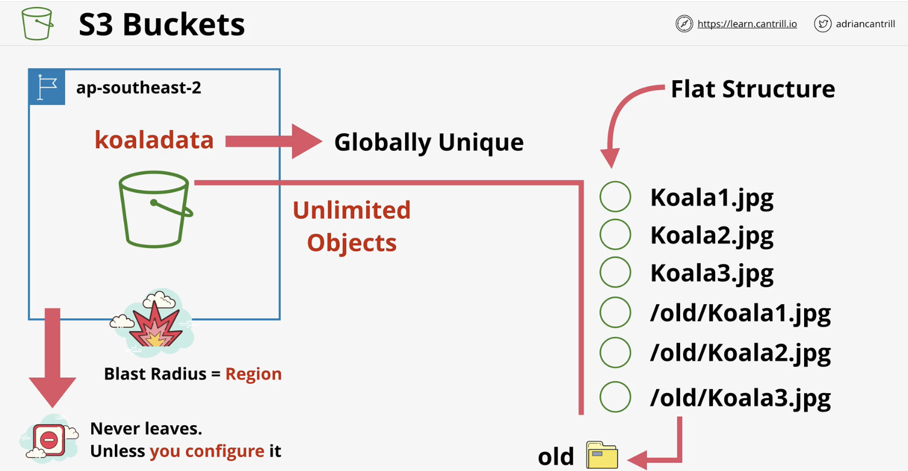

# AWS Fundamentals

### Public VS Private Service

It's all about networking, no permissions by default \(ie: login\)

Private services like EC2 can be accessed by public network by 'pushing' part of it to aws public network.

### Global network

Edge locations are more specific, preferred for low latency needs



### VPC

A **default VPC is created once per region \(only 1 per region\)** when an AWS account is first created.

There can only be one default VPC per region, and they can be deleted and recreated from the console UI .

Default VPC is always configured the same

They always have the same IP range and same '1 subnet per AZ' architecture.

resilient across availability zones

You'll probably need custom VPC

### EC2 - Elastic Cloud

VPC network means EC2 is AZ resilient

Terminate = delete \(irreversible\)

storage is still used when instance is stopped

3389 port  remote desktop protocol - windows

22 port for ssh protocol - mac/ linux

### EC2 Practical

* Go to EC2
* Create keypair -&gt; use pem if ssh/ linux -&gt; save private part of key
* Launch instance \(eg for type: linux, Amazon linux 2 AMI, x86, t2micro \(free\)
* configure instance -&gt; default
* add storage \(device id, root vol\) ...
* security group \(1 security group can be many-to-many mapping\), set source to my IP \(or limit it somehow\)
* review and launch -&gt; launch
* select a key pair \(public key on instance\)
* state = pending, then ready
* click on instance -&gt; connect to instance, copy the `ssh ....` command
* move to folder w pem, might need to run chmod command
* run ssh

### S3

Default storage service

Objects are like files

bucket are created by default in a region

folders are referred to as prefixes, because /old/koala.jpg is positioned in old folder

has no file-based system, it's flat

