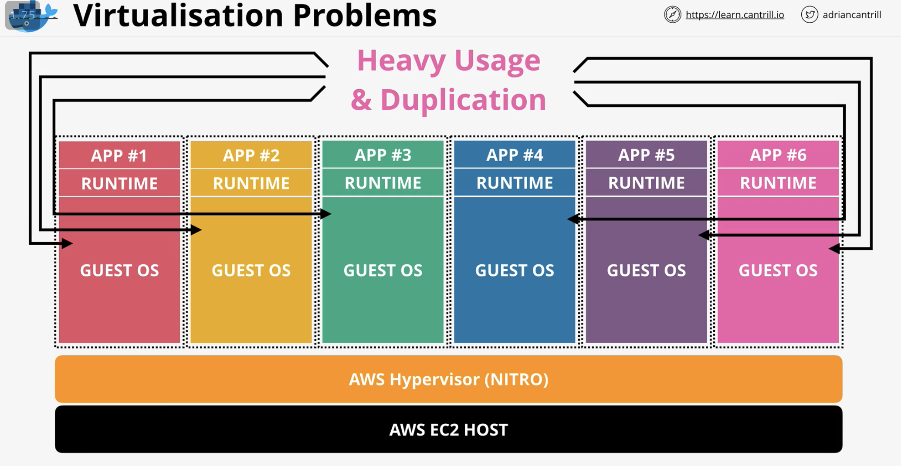
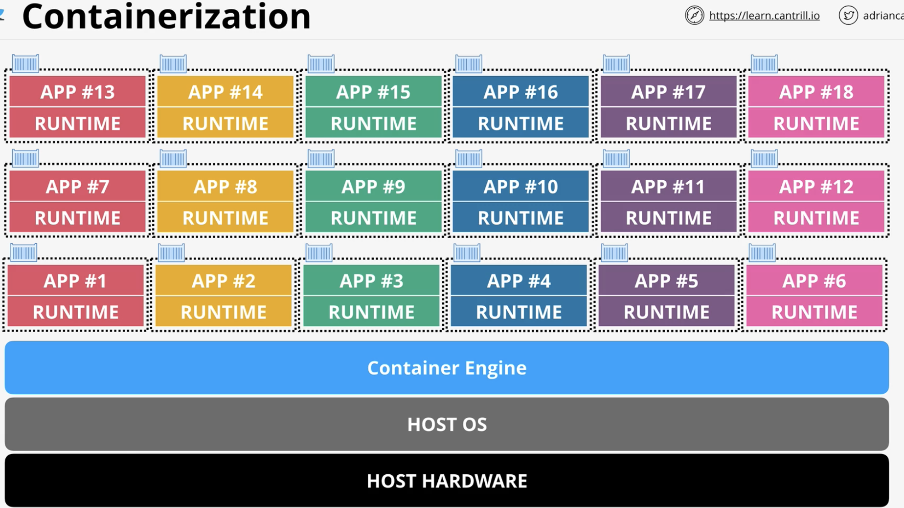
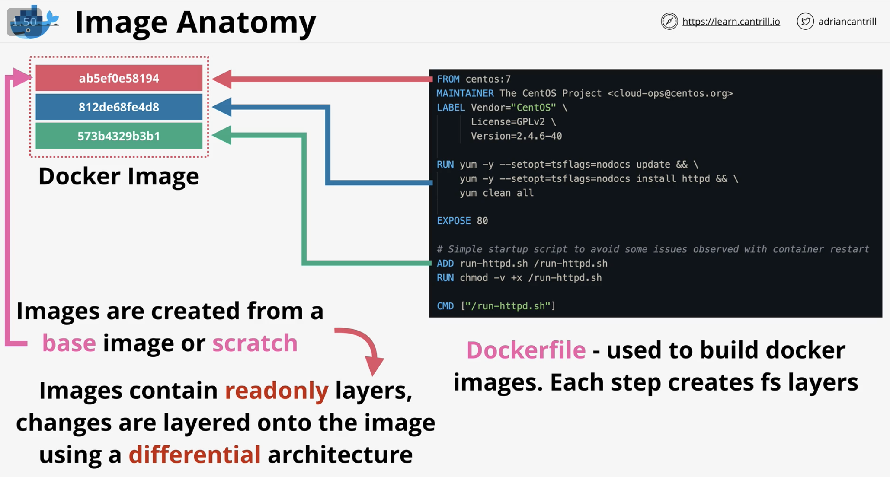
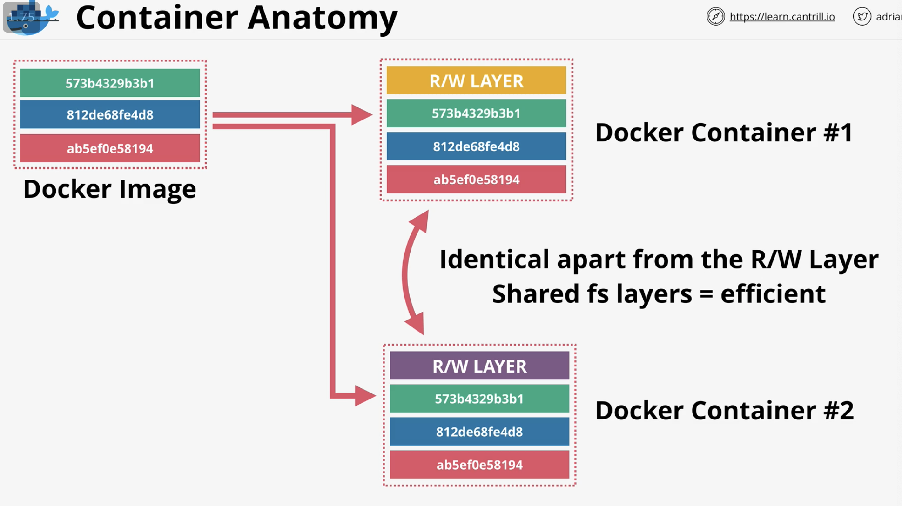
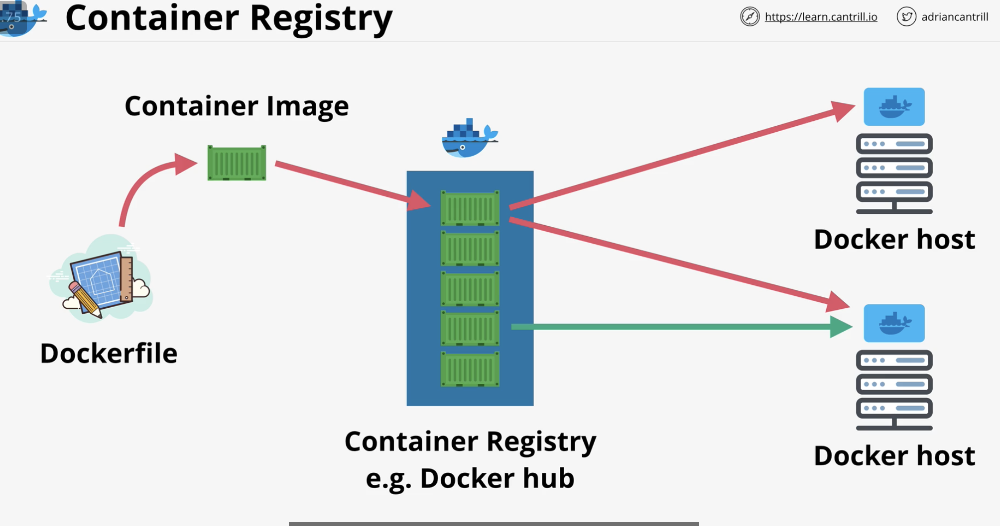
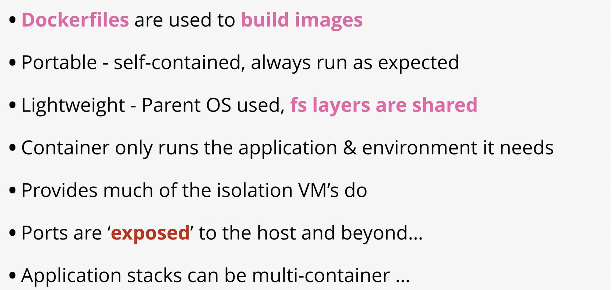
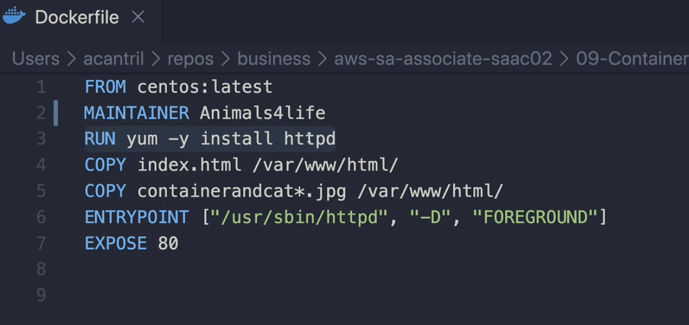
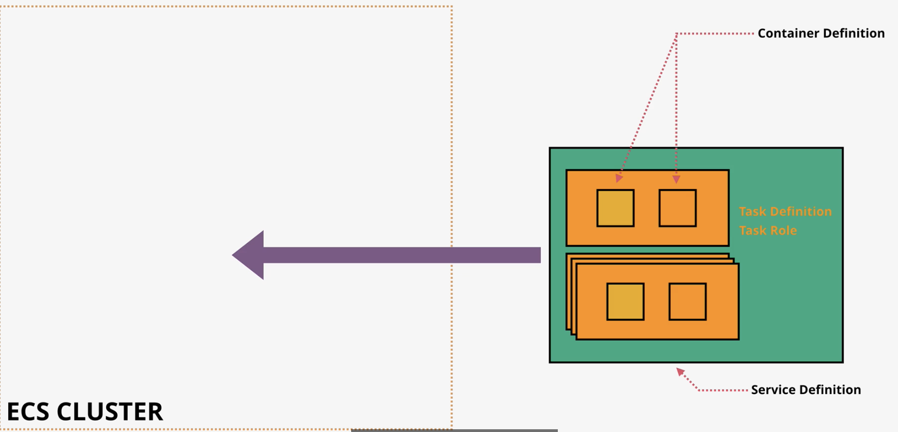
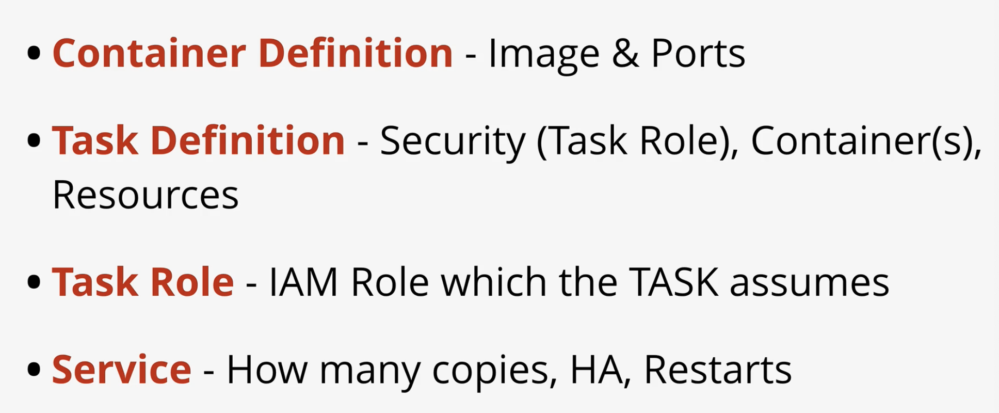

# CONTAINERS & ECS

## Virtualization problems

Guest OS is duplicated

Containers solve the problem by having the container runs as a process in the host OS, but each container is isolated from each other

Much lighter than virtualization

Container is running copy of docker image

Docker image is created by Dockerfile steps

first line is base image, centos:7, and each instructions layers on top of it

Docker container has read write layer

Base layers can be gotten from the registry, eg Dockerhub

Demo: [https://learn.cantrill.io/courses/730712/lectures/14640455](https://learn.cantrill.io/courses/730712/lectures/14640455)

* ec2 instance connect
* [Lesson Commands](https://github.com/acantril/aws-sa-associate-saac02/blob/master/09-Containers-ECS/container_of_cats/lesson_commands.txt)
* install docker
* sudo service docker start
* give user permission to use docker `sudo usermod -a -G docker ec2-user`
* exit and log back in ec2 instance
* `sudo yum install git`
* `git clone {repo}`
* there should be Dockerfile, jpeg files

entrypoint is apache web server

* `docker build -t containerofcats .`
* `docker images`
* `docker run -t -i p 80:80 containerofcats`
* `docker login --username {name}`
* enter password
* `docker tag {img id} {user}/{image name}`

##  ECS - Elastic Container Service

ECS lets you create a cluster, which is where containers run from

ECR: aws container registry

Container definition tells ECS where container is, which port is used on container

think of container definition as just a pointer to where container is stored, and which port

task may contain 1 or more containers

task definition store the rest: storage mode, task role, which give containers within ecs permission to access aws services

service lets you determine how to scale task, load balance for tasks, replace failed tasks, etc

