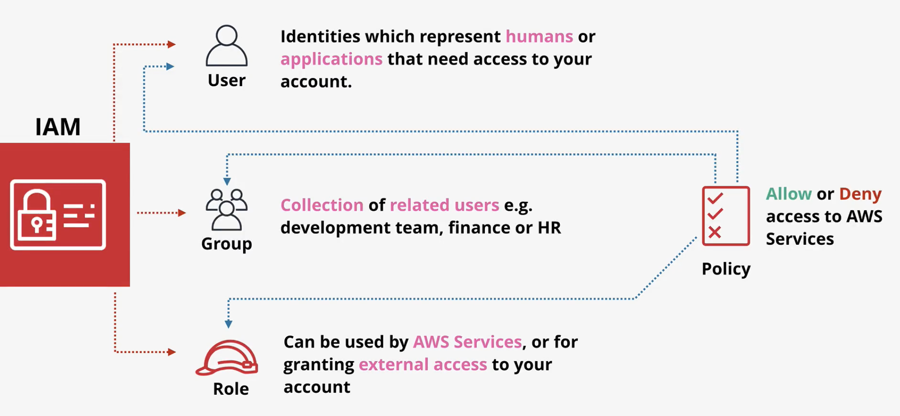
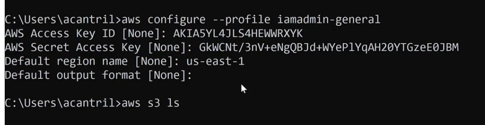

# Course Fundamentals and AWS Accounts

Aws account is a container for identities\(users\) and resources

* require unique email
* require a credit card \(not unique\), billed for consumption
* has a ROOT USER initially \(has full control, can't be restricted\)
* IAM users to create additional users, groups and roles \(can have limited permission, starts off with no permissions\)


You should have multiple AWS accounts so as to limit impact of breach \(eg: test, development, staging, production\)


Add Management Account:

* Add MFA
* Add Billing Alarm
* Add IAM user: IAMADMIN

Add Production Account:

* Add MFA
* Add Billing Alarm
* Add IAM user: IAMADMIN


You can use one email address for the unique email address for multiple accounts with `+` suffix:  
  
huitian+aws1@gmail.com, huitian+aws2@gmail.com


### MFA

multi-factors authentication

factors can be: knowledge, possession \(eg: atm card\), inherent \(eg: retina scan\), location \(eg: wifi\)

### **Activate IAM access to billing**

Under account settings, near the bottom of the page, activate IAM access to billing so IAM users/roles with billing access can see bills

**IAM user/role access to billing information is activated.**

### **IAM Basics**

**User: identities representing humans or apps**

**Group: collection of related users**

**Role: Used by aws services or for external access to your account \(uncertain number of things that needs access, eg: can be given to ec2 instances\)**

* An IAM user has 1 username and 1 password \(password is optional for CLI IAM user\)
* An IAM can have two access keys

### Access keys

Go to account settings, and create an access key.


Access secret will only be shown once


### AWS CLI



Instructions to configure profile \(iamadmin-general is a name you can specify\), and list s3 buckets

`aws s3 ls --profile iamadmin-general`  

