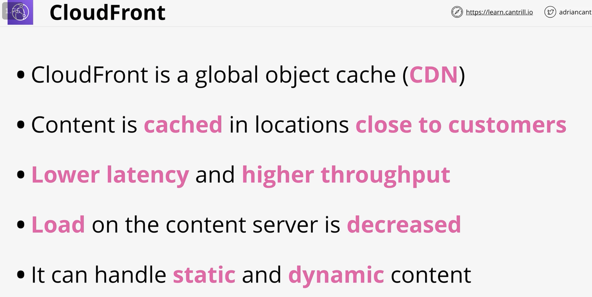
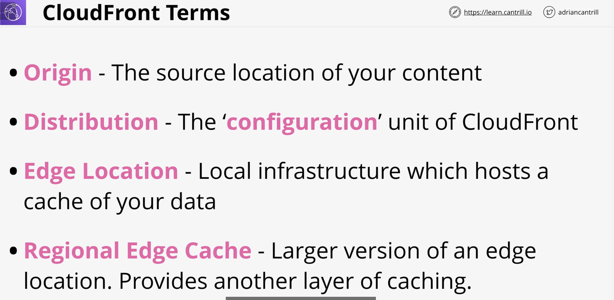
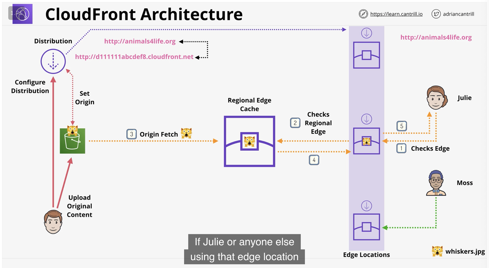
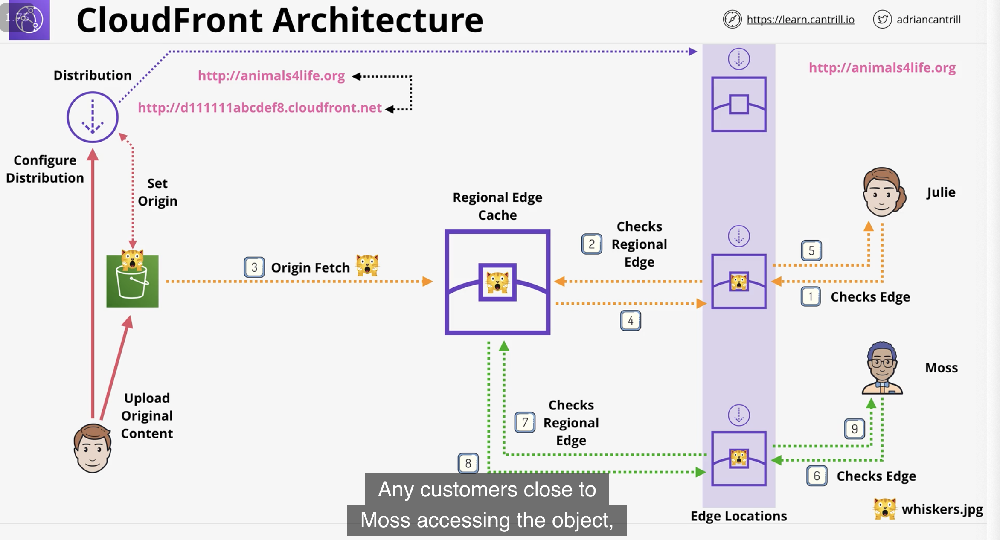
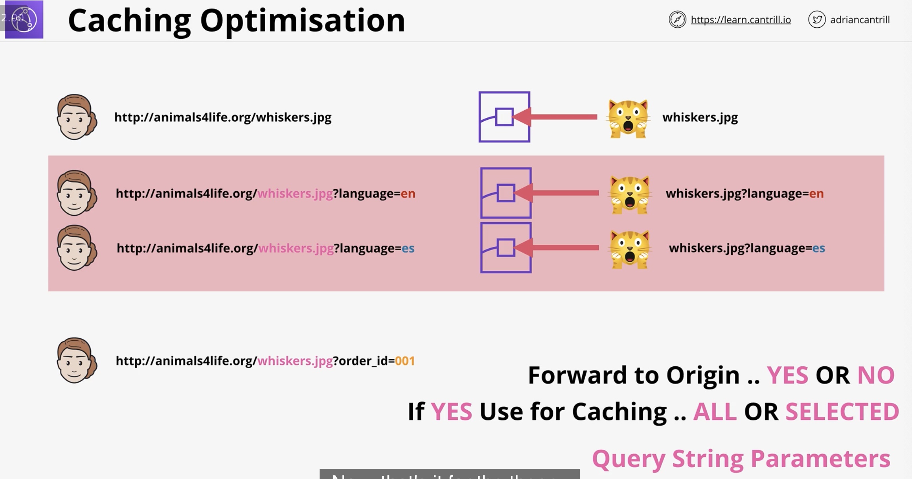

# GLOBAL CONTENT DELIVERY AND OPTIMIZATION

client is actually acccessing cache in locations closer to them with cloudfront

origin can be anything, is location of your content, as long as it's on internet

config of cloudfront is in 'distribution'

edge locations are generally in larger cities, smaller than aws regions, generally one or more racks in 3rd party distributor

config distribution to have s3 bucket as origin

the domain name for cloudfront edge locations is unique to your distribution

if not at local edge location, will check regional edge location, otherwise origin fetch

caching is done on query string level

you can remove the benefit of caching if you configure query string params wrongly!

Choose NO for forward to origin of query string params if you don't need it cached at query string level

## ACM - AWS Certificate manager

certificates are certs that allows HTTPs website handle encryption and prove its identity

