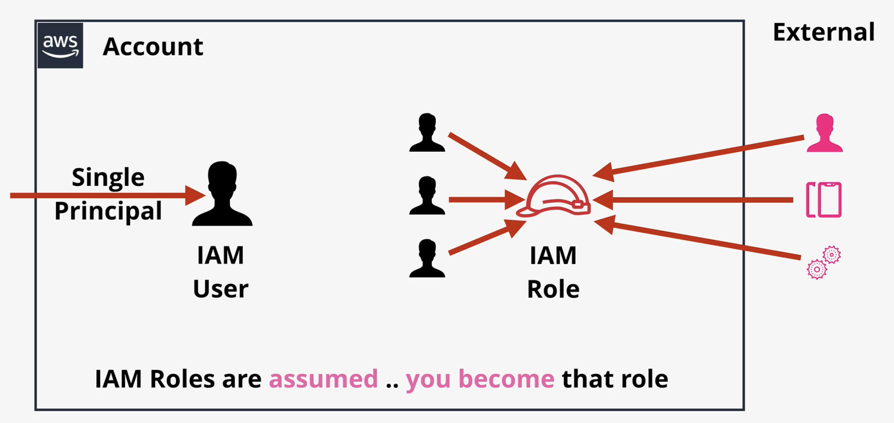

# IAM, ACCOUNTS AND AWS ORGANISATIONS

### IAM Policies

If there's overlap, it's like a venn diagram with priorities \(ordered\):

* explicit DENY
* Explicit ALLOW
* implicit DENY \(by default\)

You may have multiple IAM policies

Inline \(most specific, only used in exceptions\)

Managed Policy \(normal default ACL, reusable, low management overhead\)

can be any named thing that needs long-lived access

arn:aws:s3:::catgifs -&gt; Bucket

arn:aws:s3:::catgifs/\* -&gt; Objects in the bucket

You may need permission for both

### Demo

* cloudformation
* create stack -&gt; upload template -&gt; enter stack name, parameters, acknowledge
* note: parameter may have restrictions, which may conflict w other restrictions
* physical id is auto generated and unique
* log in as iam user
* for inline policy, find user, add inline policy

### IAM Groups

* no credential, can't login as group

### Demo for groups

[https://learn.cantrill.io/courses/730712/lectures/14275294](https://learn.cantrill.io/courses/730712/lectures/14275294)

[1-Click Deployment](https://console.aws.amazon.com/cloudformation/home?region=us-east-1#/stacks/create/review?templateURL=https://learn-cantrill-labs.s3.amazonaws.com/awscoursedemos/0023-aws-associate-iam-groups/groupsdemoinfrastructure.yaml&stackName=IAMGROUPS)

In this \[DEMO\] we investigate how groups can be used to hold permissions for group members.

Permissions which were assigned to the IAM user 'Sally' are migrated to a new development group we create in the demo.

### IAM ROLES

used when the no of principles is unpredictable, or is short-lived, or external

Trust policy list the identities that's allowed/ disallowed

then if allowed, it generates temporary security credentials

credentials are checked against permissions policy

sts:AssumeRole, means IAM roles is involved as the identity assumes the role

### When to use IAM roles

#### LAMBDA

AWS lambda, performs function, has no permission by default. 

Running it is called lambda invocation.

Create IAM role known as lambda execution role, rather than hardcode access key in lambda function

When lambda function runs, it uses the sts:AssumeRole operation

hardcode = security risk, hard to rotate

#### HELPDESK scenario \(Emergency/ Exception\)

readonly access for helpdesk member by default, but emergency occurs and a role can be used.

#### External Identities \(&gt;5000 users\)

on-premise sign in, eg: microsoft active directory, with &gt; 5000 staff

#### Mobile app with a lot of users

web identity federation \(eg facebook\)

#### Partner account \(Organizations\)

can use aws organization, eg: for uploading to a partner account

### AWS Organizations

large organizations used to have to multiple aws accounts

you can use an account to create the organization

existing accounts can be added to the org

the account used to create the org is the management acct

you can create levels \(root, ou\)

org has consolidated billing

includes all billing from all accounts

benefits from cheaper price at scale

can create an account within an org

large orgs may separate concerns

management account for billing, and another for IAM

### Org Demo

[https://learn.cantrill.io/courses/730712/lectures/14293488](https://learn.cantrill.io/courses/730712/lectures/14293488)

In this \[DEMO\] Lesson we will create an organisation for the Animals4life business.

The GENERAL account will become the MASTER account for the organisation

We will invite the PRODUCTION account as a MEMBER account and create the DEVELOPMENT account as a MEMBER account.

Finally - we will create an **OrganizationAccountAccessRole** in the production account, and use this role to switch between accounts.

WARNING : If you get an error "You have exceeded the allowed number of AWS Accounts" then you can go here [https://console.aws.amazon.com/servicequotas/home?region=us-east-1\#!/services/organizations/quotas/L-29A0C5DF](https://console.aws.amazon.com/servicequotas/home?region=us-east-1#!/services/organizations/quotas/L-29A0C5DF) and request a quote increase for the number of member accounts in an ORG

