# Relational Database Service \(RDS\)

## Database Refresher

SQL vs NoSQL

Relational DB has a rigid schema

defined in advanced, the relationship between tables and the structure

NoSQL is the alternative, not a single thing, but generally more relaxed in schema

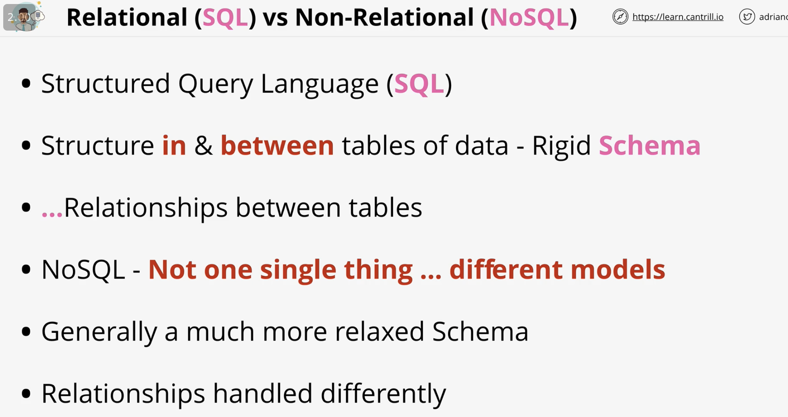

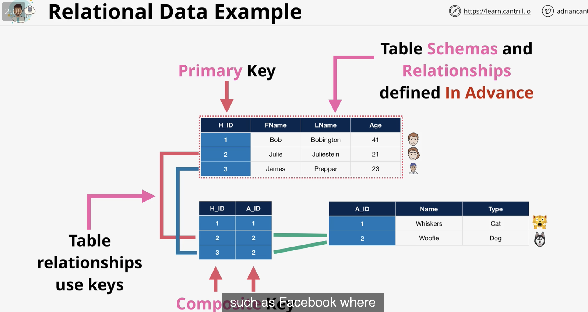

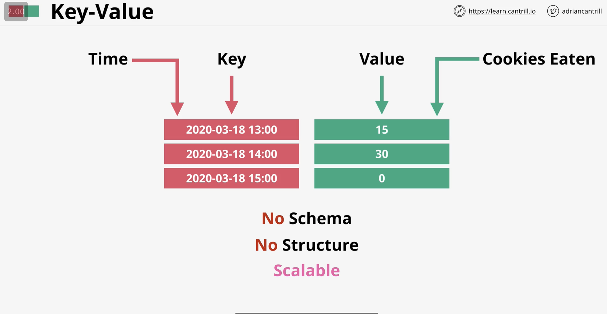

Key value is really fast because of the simplicity

good for in-memory caching


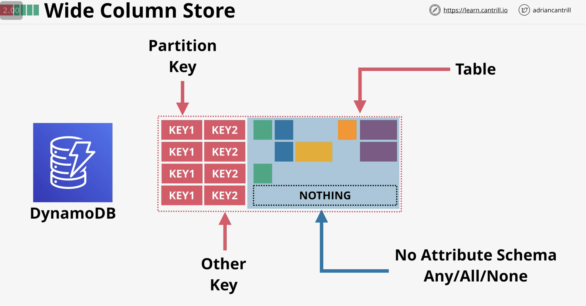

sort/ range key for aws secondary key

architecture of key structure are rigid

the attributes of a table can be different for each row

can't do relational queries




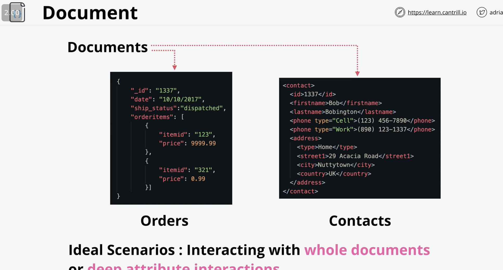

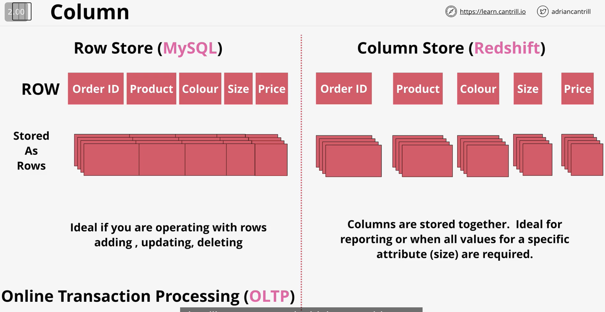

Redshift is a data warehouse product 

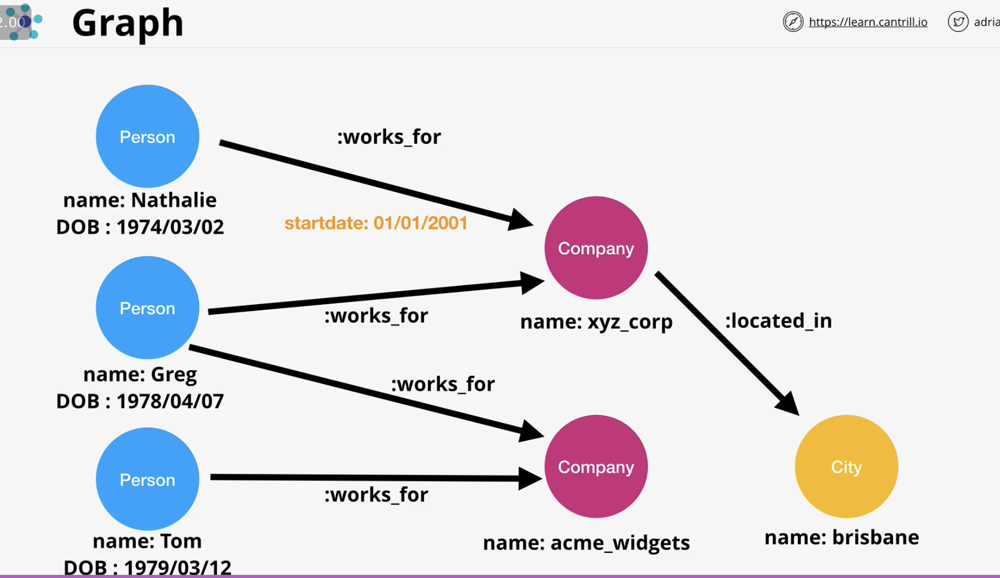

good for complex relationship/ social media

## Acid vs BASE

This lesson steps through the ACID and BASE Database transaction models and introduces the CAP Theorem

[https://en.wikipedia.org/wiki/CAP\_theorem](https://en.wikipedia.org/wiki/CAP_theorem)

[https://en.wikipedia.org/wiki/ACID\#Consistency](https://en.wikipedia.org/wiki/ACID#Consistency)

[https://en.wikipedia.org/wiki/Eventual\_consistency](https://en.wikipedia.org/wiki/Eventual_consistency)



CAP

Consistency: every read will get most recent write or errors out

Availability: will only receive non-error response, but not guaranteed to be most recent write

Partition tolerant: multiple network partition, and system continues to operate despite having dropped messages or errors between nodes

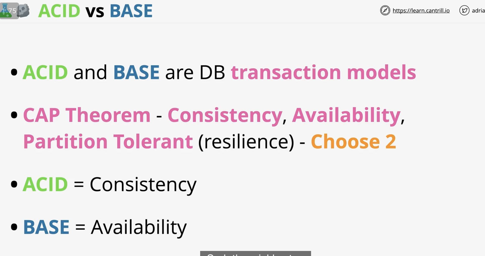

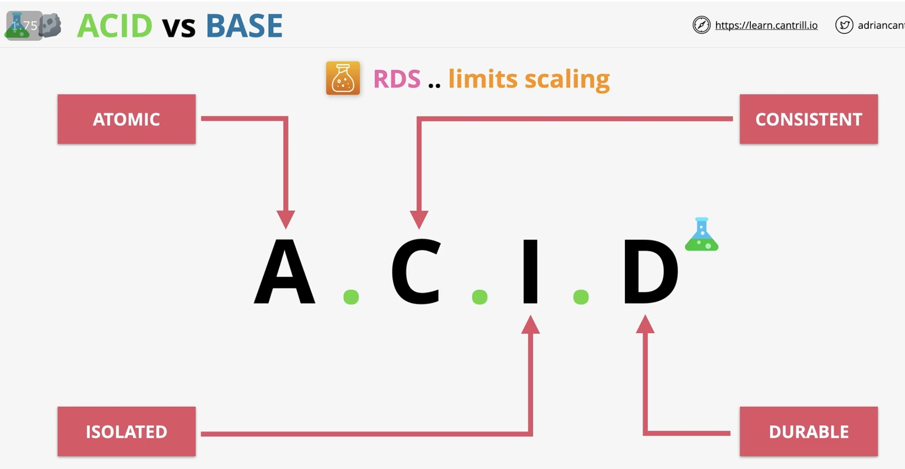

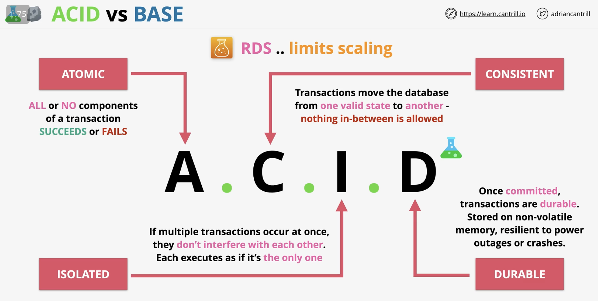

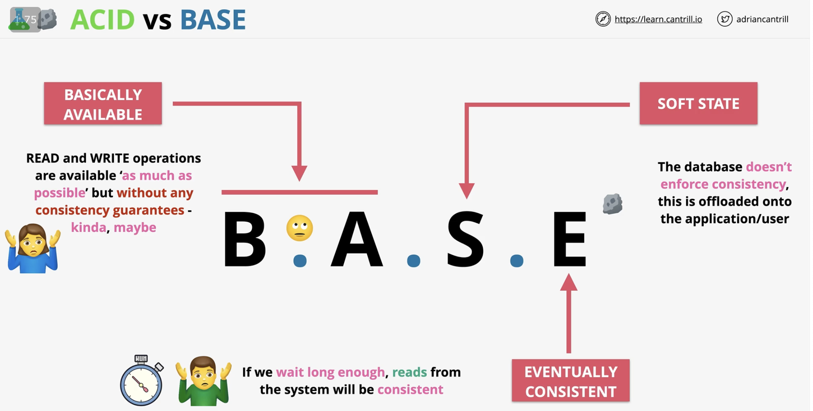

BASE refers to NoSQL, DynamoDB

ACID refers to SQL, may refer to Dynamo DB Transactions

## Databases on EC2

usually not a good idea to run db on ec2, unless you know what you're doing

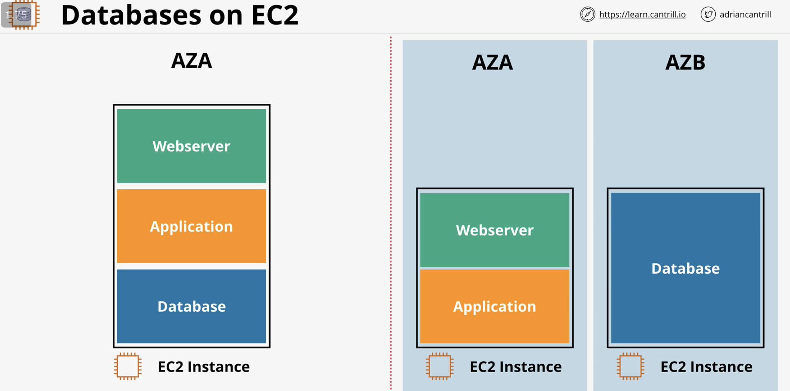

splitting introduces dependency and cost

Not really justified: need access of os of db, but there's not many reasons why you need that

Not really justified: option tuning, but aws allows you to tune with other services

Justified: db or db ver aws don't provide

Justified: specific os/db combination

Justified: aws architecture don't provide

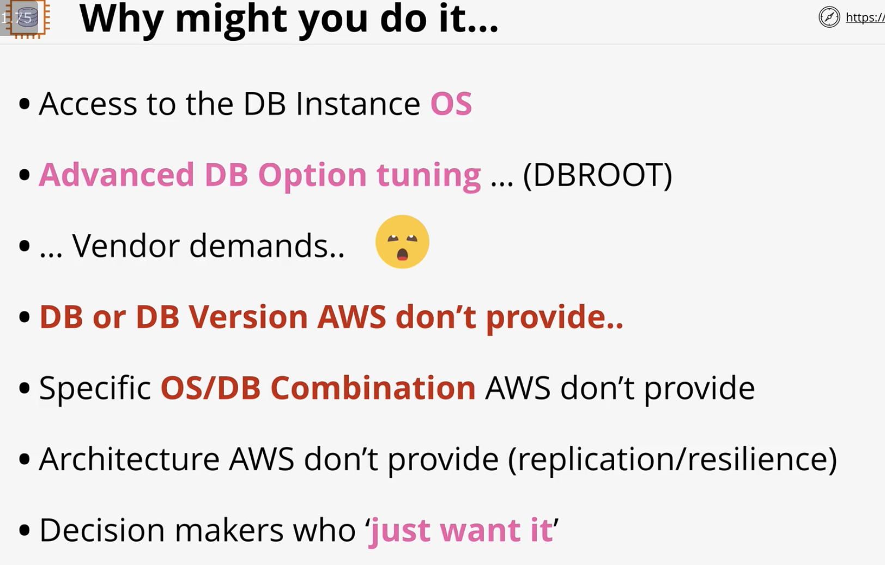

patching of db with app, need to do out of core usage hours

backup/ DR management: many aws managed products have automation, why change the formula?

single AZ, need ebs snapshots, put snapshots outside of AZ

aws DB products are already good, better for replication, performance features, why diy?

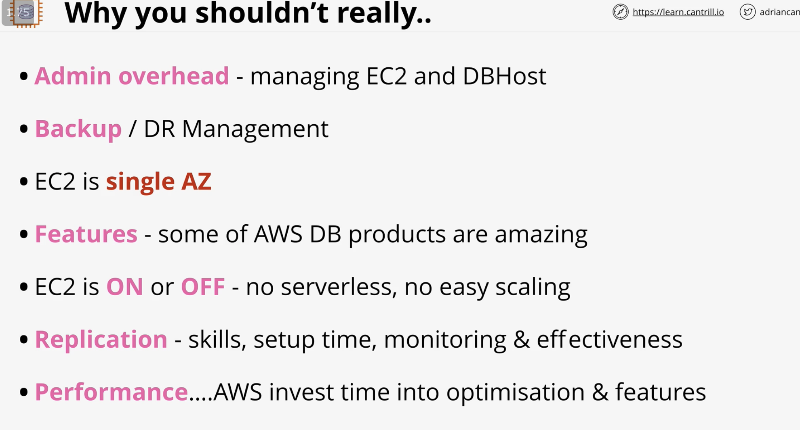

## Migrating Wordpress Monolith to dedicated EC2 DB

In this demo lesson you will migrate the database for the monolithic animals4life Wordpress instance to a dedicated MariaDB platform running on EC2.

The outcome of this lesson is to understand the process for performing a simple database migration manually...

[1-Click Deployment](https://console.aws.amazon.com/cloudformation/home?region=us-east-1#/stacks/create/review?templateURL=https://learn-cantrill-labs.s3.amazonaws.com/awscoursedemos/0014-aws-associate-rds-dbonec2/A4L_WORDPRESS_ALLINONE_AND_EC2DB.yaml&stackName=MONOLITHTOEC2DB)

[Lesson Commands](https://learn-cantrill-labs.s3.amazonaws.com/awscoursedemos/0014-aws-associate-rds-dbonec2/lesson_commands.txt)

Deployment Time **~15 minutes**

Demo Time **~15 minutes**

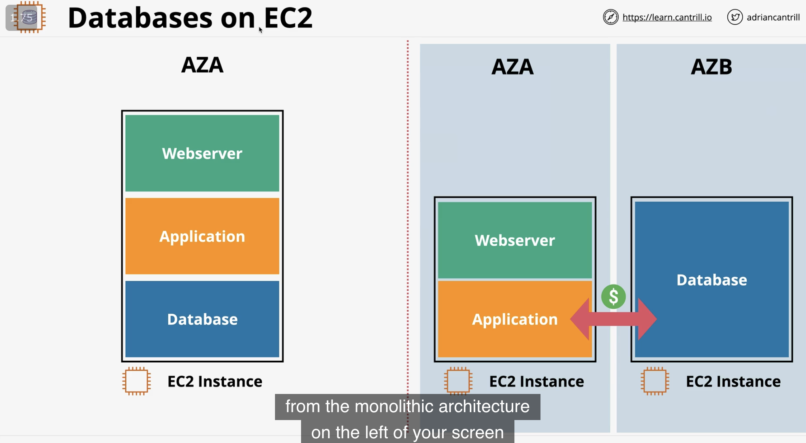

* create stack
* go to WP instance, go to IP, install WP, make a simple post
* images are now stored in instance which later needs to be migrated out to its own file system
* right click WP instance and EC2 instance connect
* get the data on db `mysqldump -u root -p {dbname} > {dbname}.sql`
* enter dbpassword
* `ls -la`
* `mysql -h {private ipv4 of db instance} -u {dbuser} -p {dbname} < a4lwordpress.sql`
* the above command takes the db dump and injects it to the new db
* enter dbpassword
* configure WP to point to the new db server
* `cd /var/www/html`
* `sudo nano wp-config.php`
* find `DB_HOST` and change from localhost to `{private ipv4 of db instance}`
* `Ctrl-O to save, Ctrl-X to exit`
* `sudo service mariadb stop` on original WP instance

## RDS

it's not DBaas and more DatabaseServer as a service, provides managed db instance

don't need to handle hardware and engines yourself

amazon aurora is so different that it should be a category on its own 

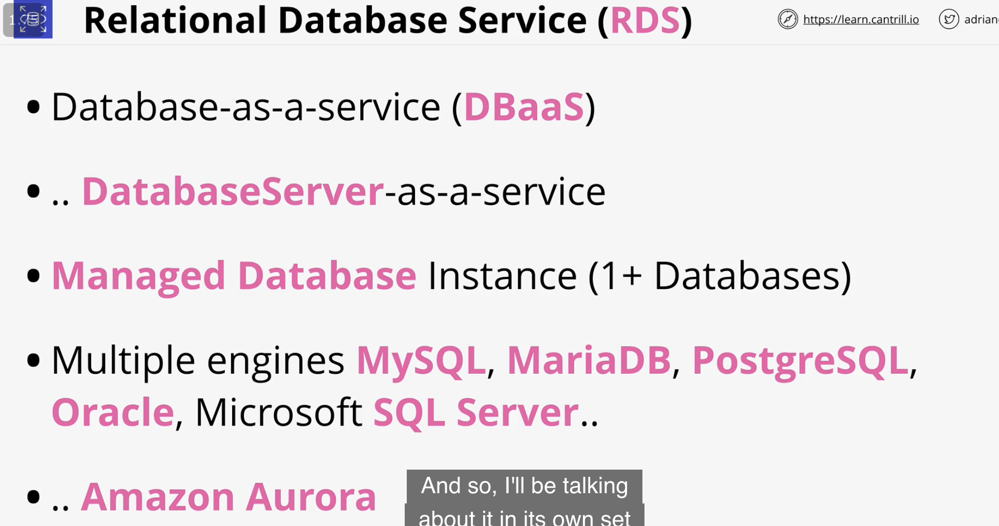

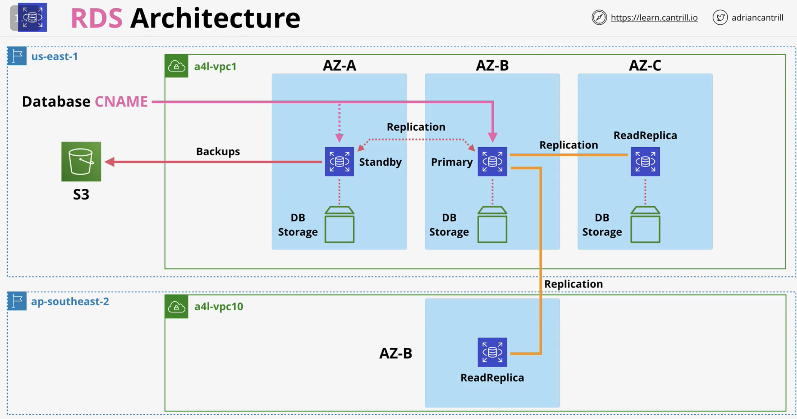

Basic building block is a rds instance \(you can create more than one db instance linked to it\)

client access using database CNAME 

interfacing with db instance is similar to other types of ec2 instance

db.m5: general, r5: memory, t3: burst, has variety of sizes

can be multi az if you have multiple instances

the simple setup in 1 az, storage is similar to ebs storage, ie: gp2 is default

pricing similar to ebs as well, allocated gb/m, so 10gb per month is same as 20gb for half a month

extra payment for io1 additional min iops

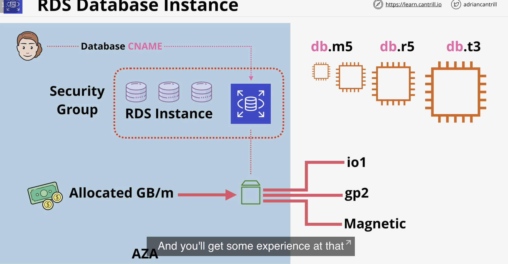

## Migrating MariaDB database into RDS

In this \[DEMO\] Lesson you will create a MySQL RDS instance and migrate the Wordpress Database from the self-managed MariaDB server running on EC2 into this RDS instance.

Due to the time required to work with RDS please ensure you have at least 1 hour to work through this demo.

[1-Click Deployment](https://console.aws.amazon.com/cloudformation/home?region=us-east-1#/stacks/create/review?templateURL=https://learn-cantrill-labs.s3.amazonaws.com/awscoursedemos/0015-aws-associate-rds-migrating-to-rds/A4L_WORDPRESS_AND_EC2DB.yaml&stackName=MIGRATE2RDS)

[Lesson Commands](https://learn-cantrill-labs.s3.amazonaws.com/awscoursedemos/0015-aws-associate-rds-migrating-to-rds/lesson_commands.txt)

Deployment Time **~15 mins**

Lesson Time **~40 mins**

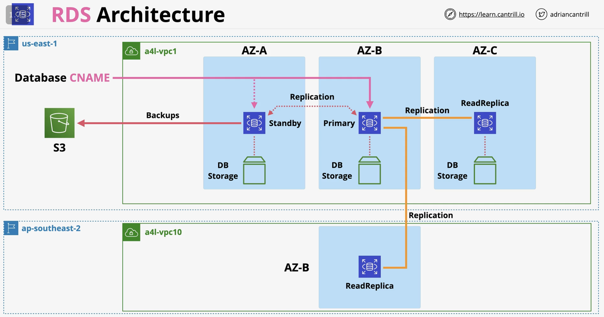

* create stack
* go to ec2 -&gt; select wordpress instance public ipv4, set up, log in wordpress and creeate post
* rds -&gt; subnet groups - create db subnet group, vpc 1, az: us-east-1a to 1c
* go to vpc -&gt; subnets -&gt; check for ip range of db1a - 1c
* subnets: choose the ip ranges for db1a - 1c
* create subnet group
* create db -&gt; standard create -&gt; engine type: some are commercial, some are free, pick mysql community -&gt; template: free tier -&gt; pick version, some may have limitations, choose 5.7.31 -&gt; instance identifier \(a4lwordpress\) -&gt; cred settings: same as rds db -&gt; instance class \(limited to free tier\) -&gt; storage \(toggle off autoscaling for demo\) -&gt; vpc: vpc1, subnet group: a4lnsgroup, public access: no, security group: create new  name a4lvpc-rds-sg -&gt; password auth -&gt; initial db name \(need for migration\), enable backups -&gt; create db
* RDS db instance has endpoint and port, with correct vpc and subnets, has security group
* click on securtiy group, which only has inbound rule allowing your ip address
* edit inbound rule, delete ip address, allow wordpress instance instead
* go back to a4l rds db instance, connectivity and security tab
* connect to a4l wordpress instance
* backup ec2 db

```text
# Backup of Source Database
mysqldump -h PRIVATEIPOFMARIADBINSTANCE -u a4lwordpress -p a4lwordpress > a4lwordpress.sql
```

* inject into rds instance \(endpoint name is the CNAME\)

```text
# Restore to Destination Database
mysql -h CNAMEOFRDSINSTANCE -u a4lwordpress -p a4lwordpress < a4lwordpress.sql 
```

* change wp-config

```text
# Change WP Config
cd /var/www/html
sudo nano wp-config.php

replace
/** MySQL hostname */
define('DB_HOST', 'PRIVATEIPOFMARIADBINSTANCE');

with 
/** MySQL hostname */
define('DB_HOST', 'REPLACEME_WITH_RDSINSTANCEENDPOINTADDRESS'); 
```

* verify by stopping db ec2 instance


