# Route 53 - Global DNS

Amazon Route53 is a highly available and scalable Domain Name System \(DNS\) web service. You can use Route53 to perform three main functions in any combination: domain registration, DNS routing, and health checking.

If you choose to use Route53 for all three functions, be sure to follow the order below:

**1. Register domain names**

Your website needs a name, such as example.com. Route53 lets you register a name for your website or web application, known as a _domain name_.

* For an overview, see [How domain registration works](https://docs.aws.amazon.com/Route53/latest/DeveloperGuide/welcome-domain-registration.html).
* For a procedure, see [Registering a new domain](https://docs.aws.amazon.com/Route53/latest/DeveloperGuide/domain-register.html).
* For a tutorial that takes you through registering a domain and creating a simple website in an Amazon S3 bucket, see [Getting started with Amazon Route53](https://docs.aws.amazon.com/Route53/latest/DeveloperGuide/getting-started.html).

**2. Route internet traffic to the resources for your domain**

When a user opens a web browser and enters your domain name \(example.com\) or subdomain name \(acme.example.com\) in the address bar, Route53 helps connect the browser with your website or web application.

* For an overview, see [How internet traffic is routed to your website or web application](https://docs.aws.amazon.com/Route53/latest/DeveloperGuide/welcome-dns-service.html).
* For procedures, see [Configuring Amazon Route53 as your DNS service](https://docs.aws.amazon.com/Route53/latest/DeveloperGuide/dns-configuring.html).
* For a procedure on how to route email to Amazon WorkMail, see [Routing traffic to Amazon WorkMail](https://docs.aws.amazon.com/Route53/latest/DeveloperGuide/routing-to-workmail.html).

**3. Check the health of your resources**

Route53 sends automated requests over the internet to a resource, such as a web server, to verify that it's reachable, available, and functional. You also can choose to receive notifications when a resource becomes unavailable and choose to route internet traffic away from unhealthy resources.

* For an overview, see [How Amazon Route53 checks the health of your resources](https://docs.aws.amazon.com/Route53/latest/DeveloperGuide/welcome-health-checks.html).
* For procedures, see [Creating Amazon Route53 health checks and configuring DNS failover](https://docs.aws.amazon.com/Route53/latest/DeveloperGuide/dns-failover.html).

## Public Hosted Zone

* hosted zone created automatically
* hosted zones are db which are referenced using name servers records

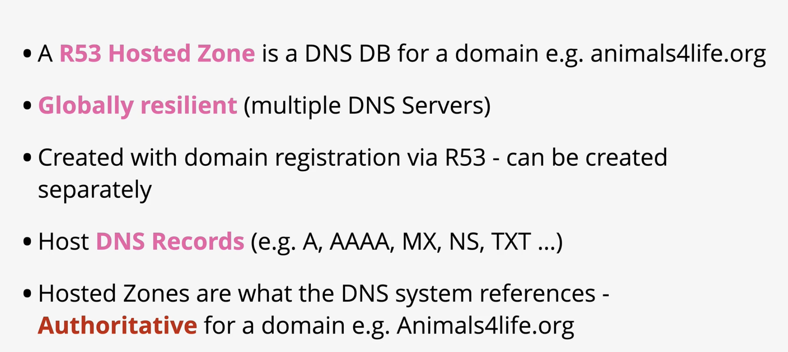

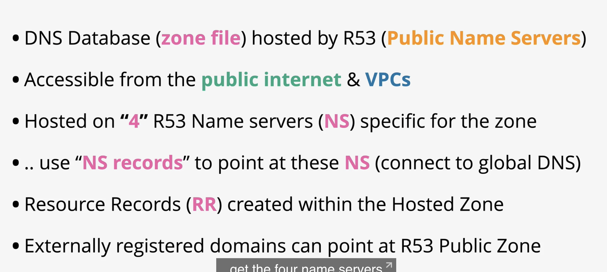

* 4 r53 name servers created for hosted zone
* those ns are accessable from internet
* if dns is enabled, can access via vpc also
* resource records can be created in hosted zone
* by default, vpc instances are alr config with vpc +2 address as DNS resolver
* ec2 instances query hosted zone through resolver
* root servers has info on .org ns records, and querying the tld servers will direct client to animals4life.org
* small fee charged for r53 service

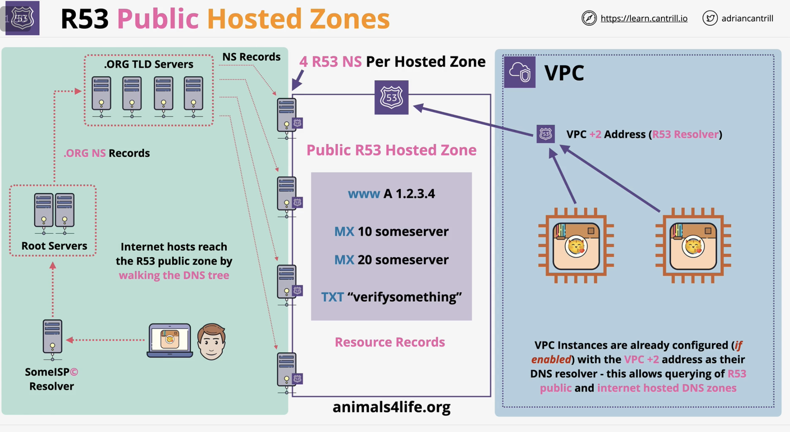

## Private hosted zone

accessible only with vpc it's associated with

you can access with cli/ api

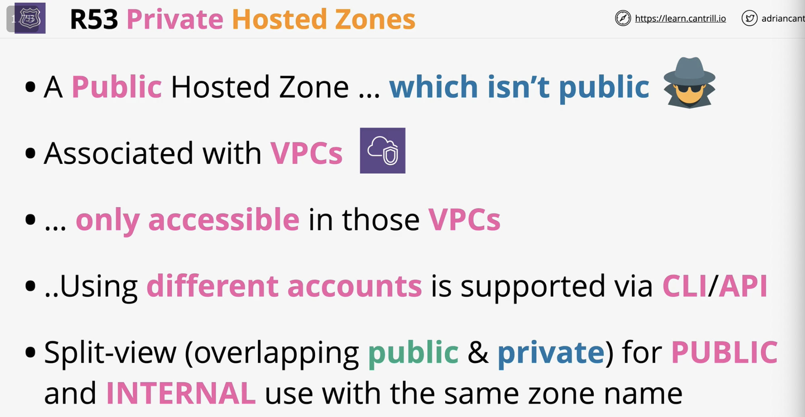

split view: if internal users access the website, they see a different ver based on creds

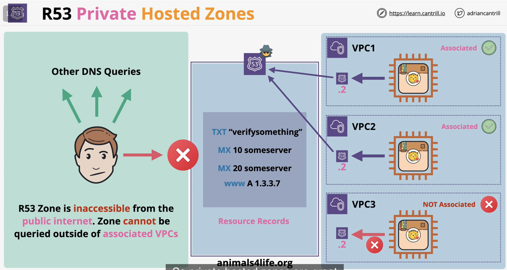

Split-view

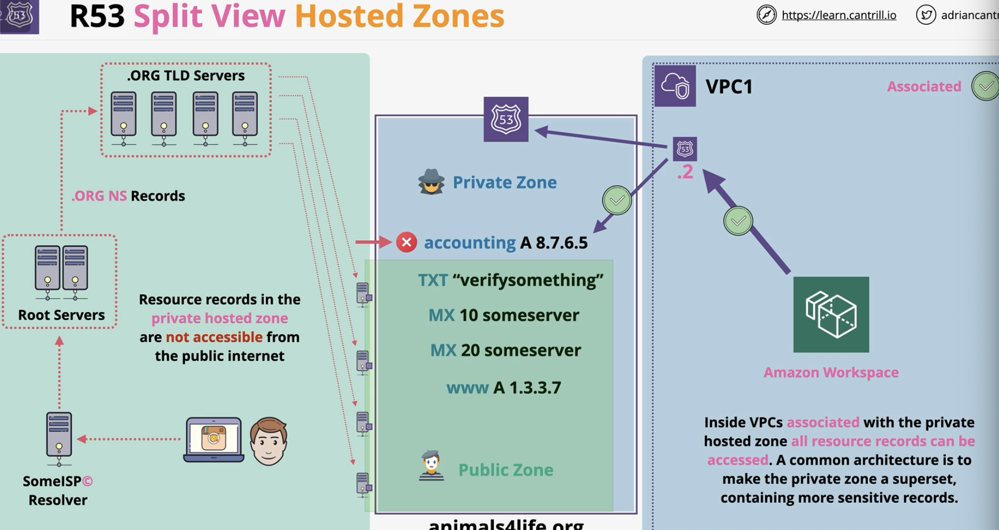

## CNAME vs ALIAS

A record maps a name to an ip address \(eg: catagram.io =&gt; 1.3.3.7\)

[https://help.easyredir.com/en/articles/453037-what-is-an-a-record-and-a-cname-record](https://help.easyredir.com/en/articles/453037-what-is-an-a-record-and-a-cname-record)

CNAME maps a name to another name \(eg: www.catagram.io =&gt; catgram.io\)

but invalid for apex domain \(eg: catagram.io\)

[https://help.easyredir.com/en/articles/453072-what-is-a-domain-apex](https://help.easyredir.com/en/articles/453072-what-is-a-domain-apex)

no ip address given for many aws services, rather a dns name is given \(elb\)

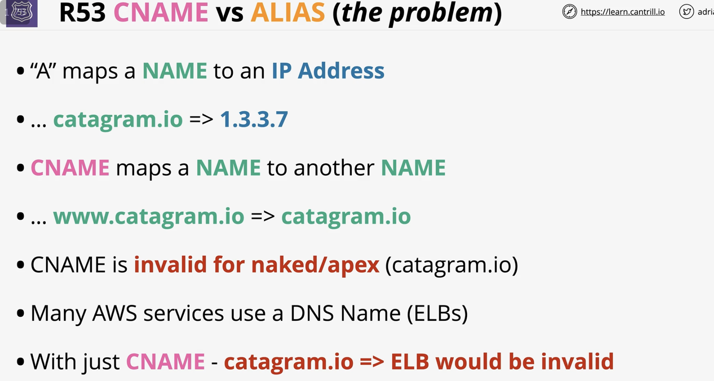

to fix the problem, you can use ALIAS

you can use CNAME for non-apex domain, but prefer ALIAS because it works for both, and is free for pointing at aws resources

type should be matched with target record

'A' Record should be the type if pointing at API gateway, cloudfront, elastic beanstalk, ELB, Global accelerator, s3

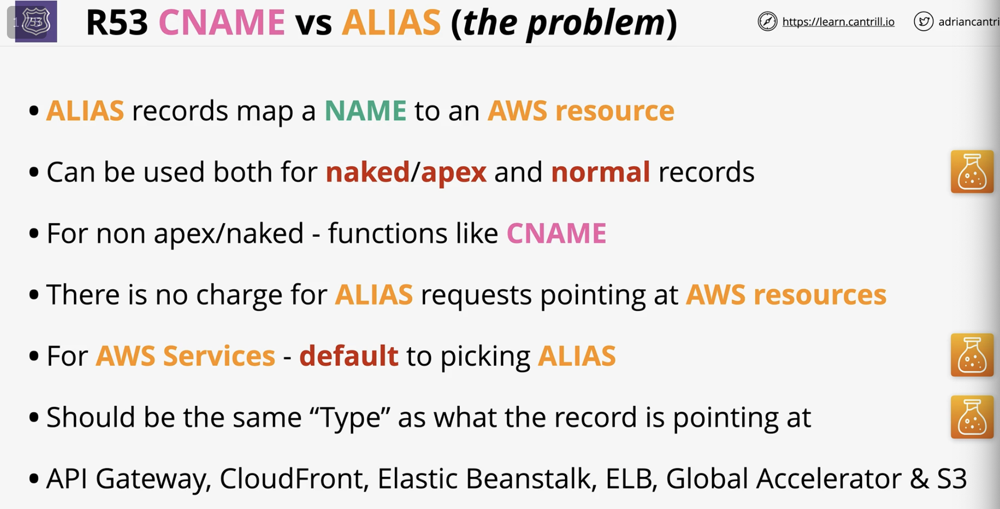

ALIAS is a type by AWS, so you can only use it if you're using Route 53 otherwise, it's not sth understood as it's not in the DNS standards

## Simple Routing \(no health check, one record/ 1 service\)

1 record per name

each record can have multiple values,

route request towards one service

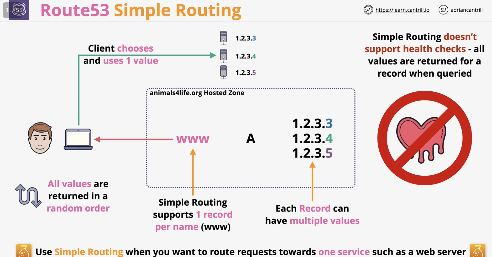

## Health Checks

health checks are seperate, configed separate

allow checks to occur, otherwise false alarms

needs ip address, check every 30 sec

http status code 200/300 range

string matching: response body matches and finds string \(only checks first 5120 bytes\)

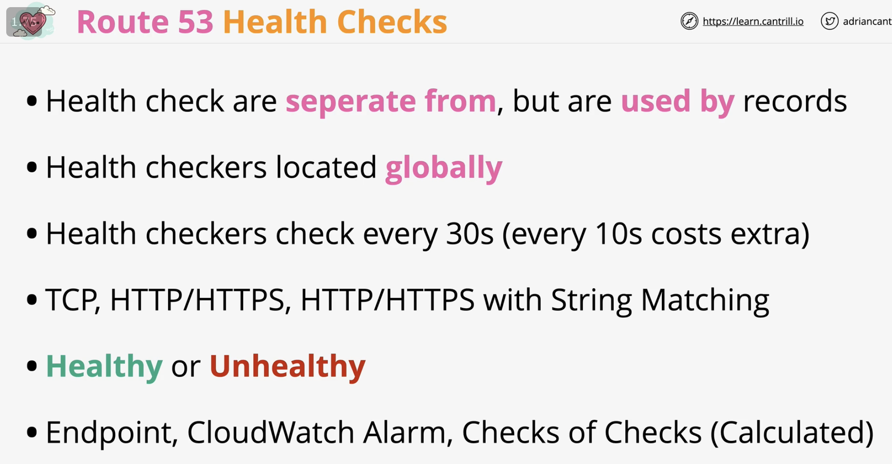

* The health of a specified resource, such as a web server
* The status of other health checks
* The status of an Amazon CloudWatch alarm

demo: [https://learn.cantrill.io/courses/730712/lectures/28015257](https://learn.cantrill.io/courses/730712/lectures/28015257)

* go to R53
* go to health check, create health check, name, choose what to monitor, \(eg: endpoint\)
* endpoint &gt; ip address, tcp, 80, etc
* advanced config: interval, failure threshold \(no of consecutive success/ failure responses before status change\), health checker regions
* get notified when fail: create alarm, create health check

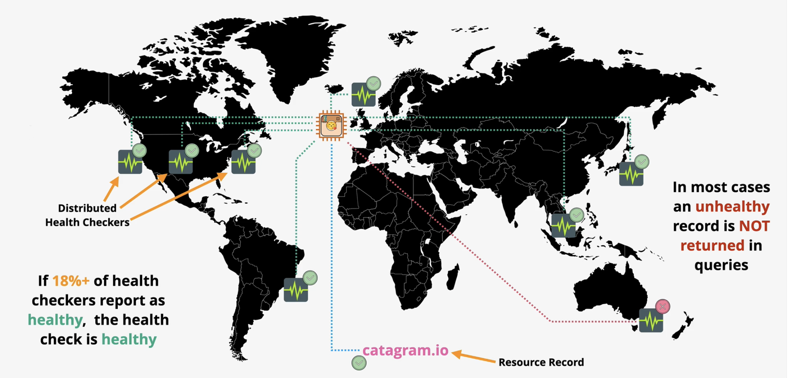

## Failover Routing \(if unhealthy, use backup\)

used so that you can display maintanence screen to users

if healthy, resolve to primary record

else use secondary record

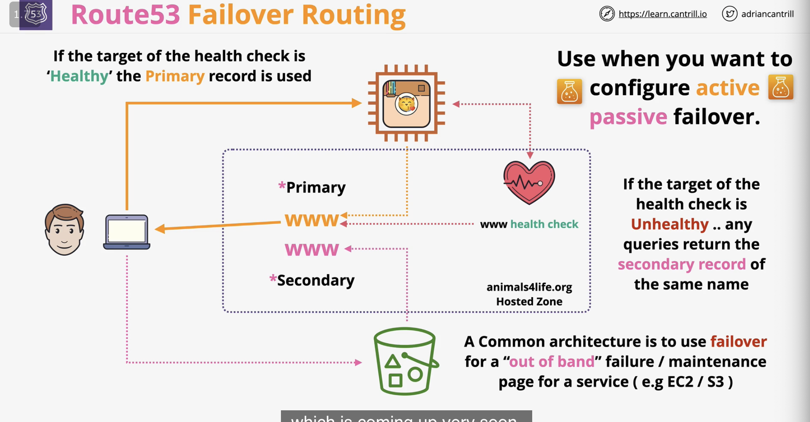

This \[DEMO\] lesson steps through how to create Failover routing and private hosted zones.

[1-Click Deployment](https://console.aws.amazon.com/cloudformation/home?region=us-east-1#/stacks/create/review?templateURL=https://learn-cantrill-labs.s3.amazonaws.com/awscoursedemos/0027-aws-associate-dns-failover-and-private-zones/A4L_VPC_PUBLICINSTANCE.yaml&stackName=DNSANDFAILOVERDEMO)



* create stack
* give instance an elastic ip address, so that it has static public ipv4 address
* go to elastic ip &gt; allocate elastic ip
* associate elastic ip with ec2 instance
* select private ip address of instance
* create s3 bucket: config as static website
* uncheck block all public access, upload index.html, and jpeg
* go to properties &gt; enable static website hosting, use index.html as index and error doc
* add bucket policy, so that it's public \(allow public read\)

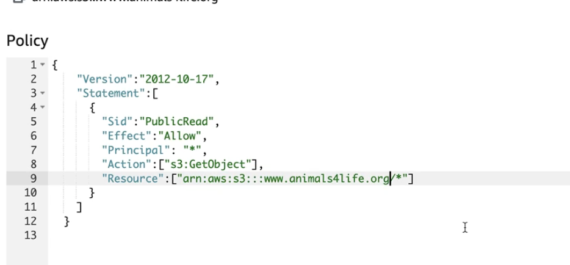

* go to R53, click on health check, create health check, endpoint
* endpoint by ip address, get ip from elastic IP associated with instance
* path is /`index.html`
* create health check
* click on hosted zone, locate your domain, create record, create failover record
* define primary failover record, route traffic: elastic ip address, failover type is primary, use healthcheck, record ID is name that is unique
* define secondary failover record, route traffic: select s3 bucket, failover type: secondary, no need health check \(this is the maintanence 'page'\)

Private hosted zone

* go to hosted zone on r53
* create hosted zone, choose vpc \(default\) \(domain name doesn't need to be owned\)
* create record -&gt; simple -&gt; record name: www, record type: A - route traffice to ipv4 or some aws resource, route traffic to ip address, 1.1.1.1
* connect to ec2 instance, `ping www.ilikedogsreally.com`
* name or service not found error, because instance is not in default vpc
* so go back to r53, expand hosted zone details, edit hosted zone, add vpc
* associate w instance vpc
* after 5 mins, it should ping successfully

## Multi Value Routing \(multi records, healthy returned\)

Multivalue answer routing lets you configure Amazon Route 53 to return multiple values, such as IP addresses for your web servers, in response to DNS queries. You can specify multiple values for almost any record, but multivalue answer routing also lets you check the health of each resource, so Route 53 returns only values for healthy resources.


Function wise, it's like a mixture of simple and failover


each record is associated w an ip and health check

failed record won't be returned

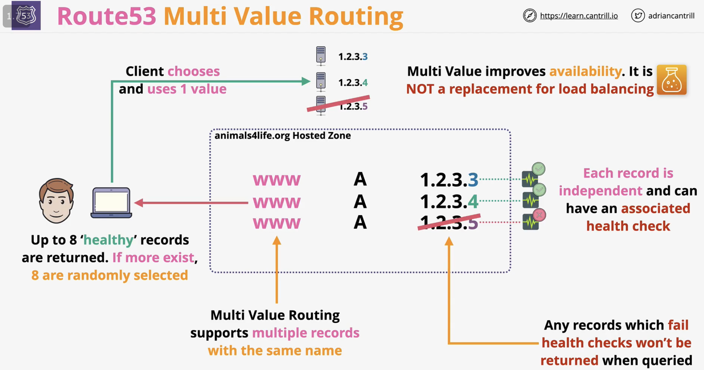

## Weighted Routing \(load balance or software ver test\)

simple load balancing, beta test new software ver

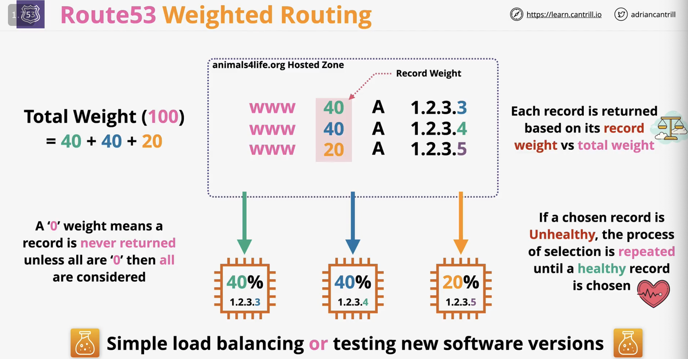

## Latency-based Routing \(performance\)

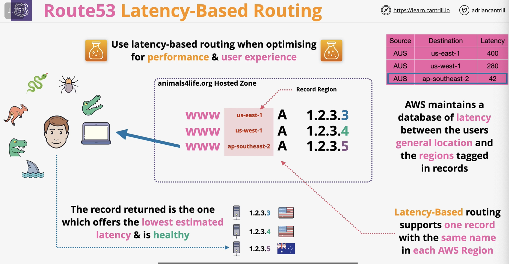

supports 1 record with same name in each region

aws knows user is in australia based on latency to region

selects based on lowest estimated latency, so the apac record is selected and returned

## Geolocation Routing \(relevancy\)

uses IP check, doesn't return closest record, it returns relevant record \(ie: shoppee.sg vs shoppee.my\)

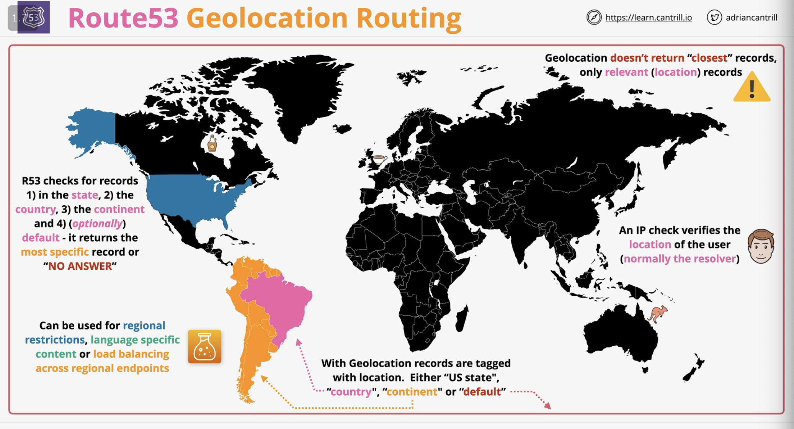

if you're in australia, but no records exist, you won't get the next closest record by region, but the default \(as it tries to find record by state &gt; country &gt; continent &gt; default\)

## Geoproximity Routing \(geographical distance with bias\)

resources are tagged geolocation

you can define a bias, so traffic can be routed towards the region with larger bias

maybe useful for news outlets?

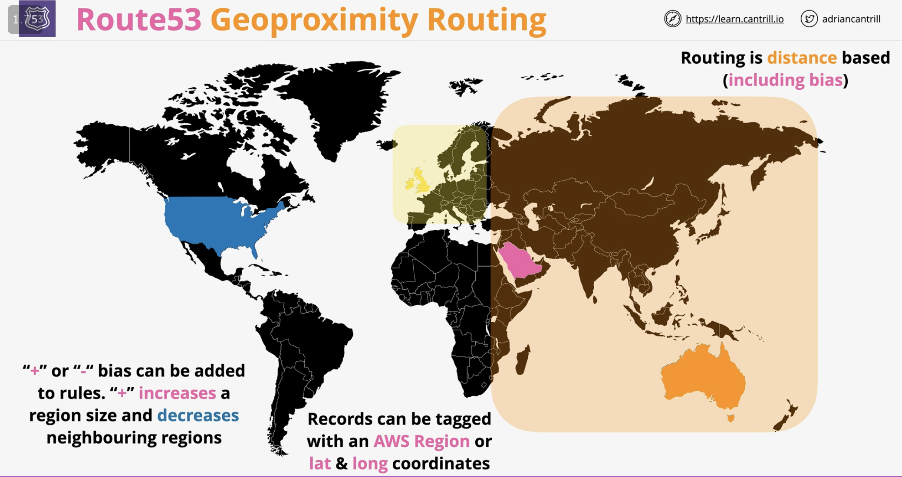

## Interoperability

when you register a domain with r53: accepts money, allocates ns, creates zone file, communicates w registry of TLD, sets ns records for domain to point to 4 ns

Note that there are two roles for r53: registrar and domain hosting

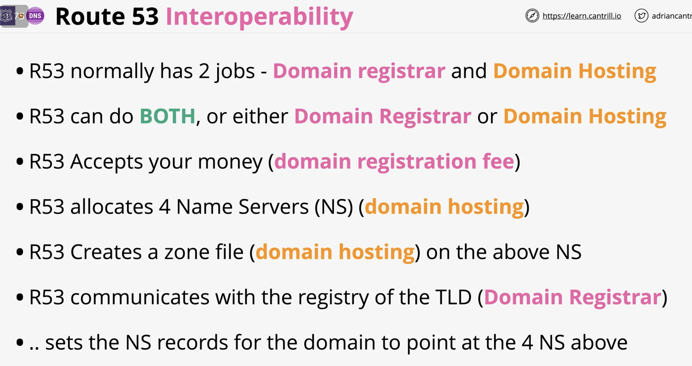

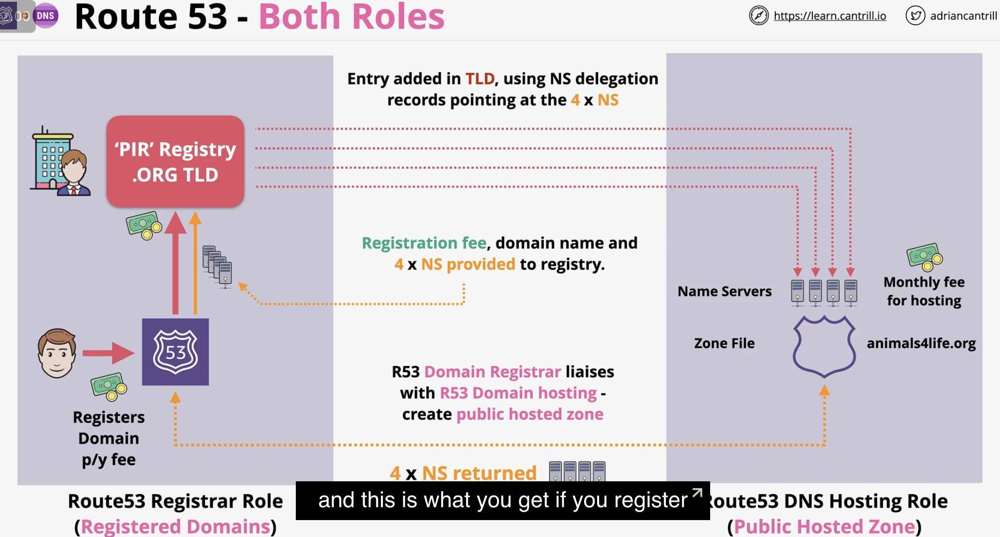

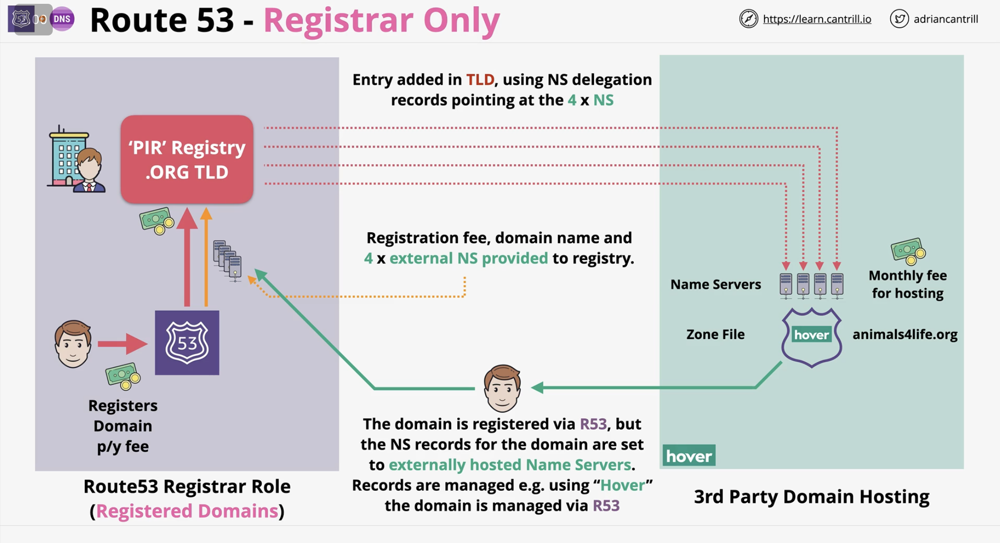

not common, cos registrar role for r53 is not anything special

hosting only is more common

 you can change the NS records after the fact via r53 if you host records via r53

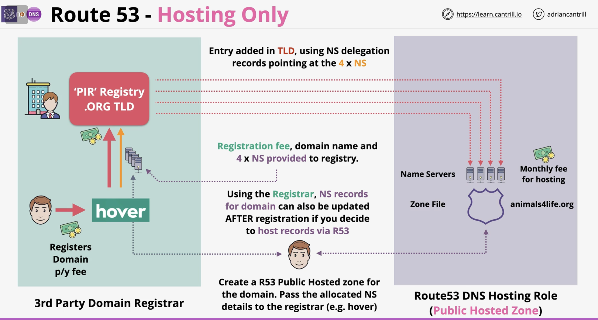

