# SERVERLESS AND APPLICATION SERVICES

## Severless and application services

internal load balancers

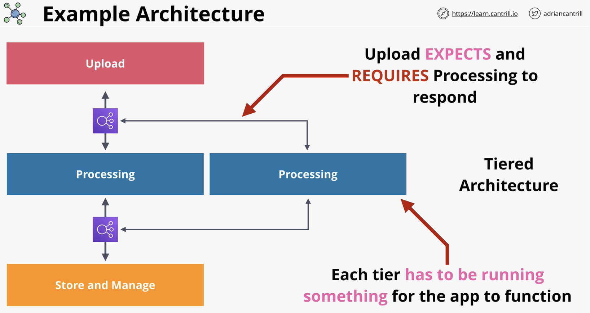

## Architecture evolution

FIFO

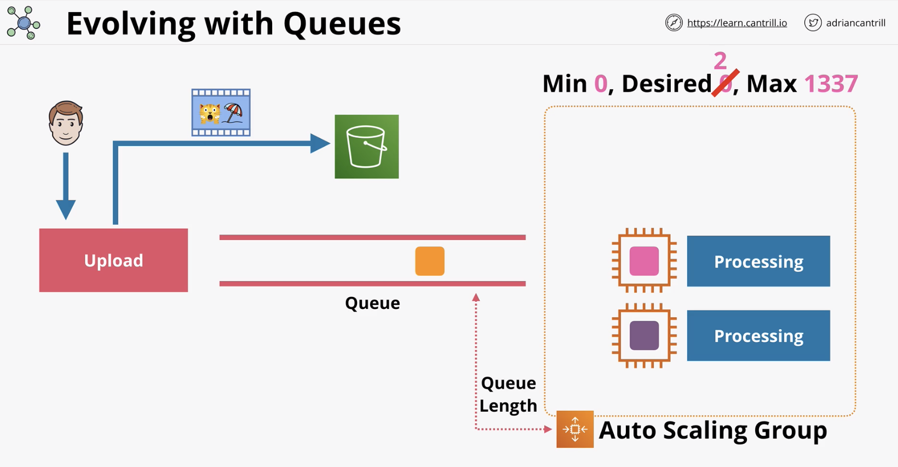

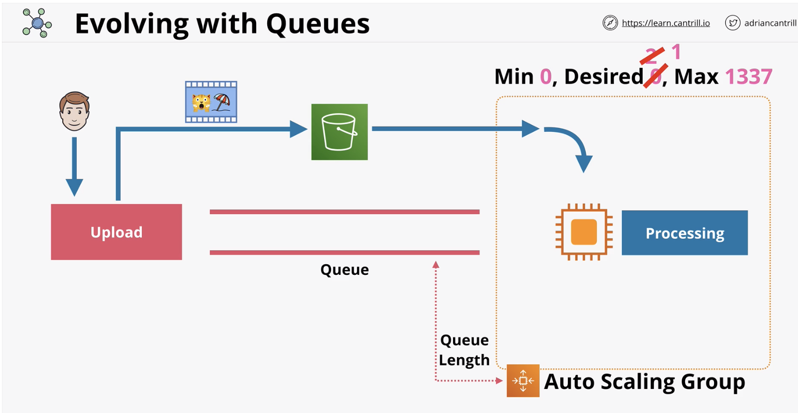

gets complex fast when each node has its own queue

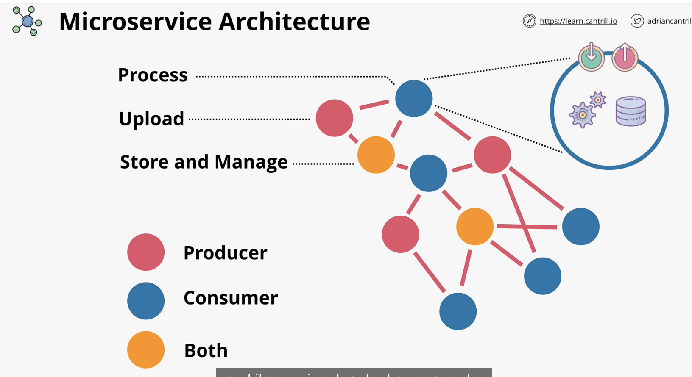

### Event

events can be eg: client uploads a video

best practice: has event router, event bus

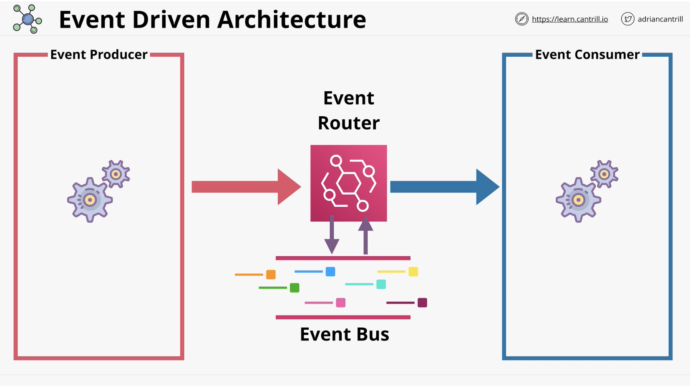

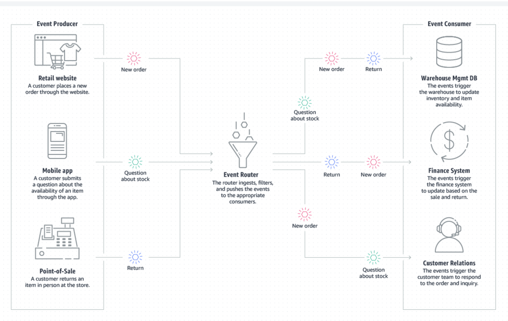

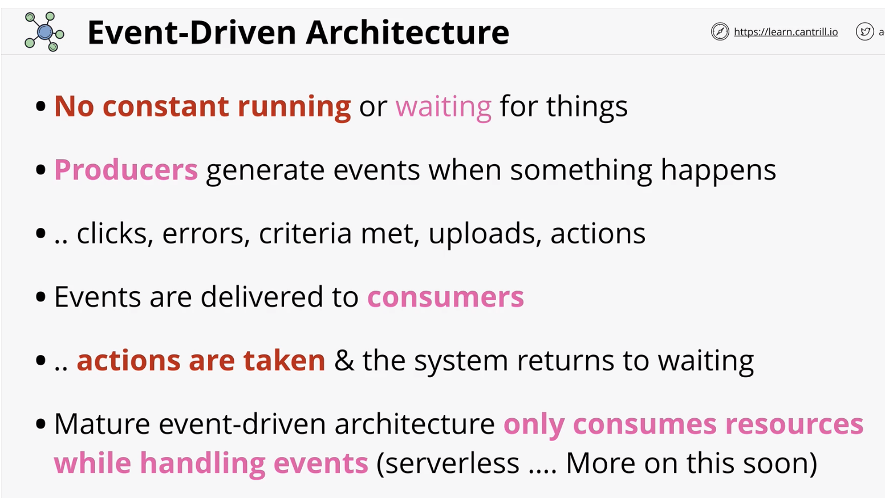

## Lambda

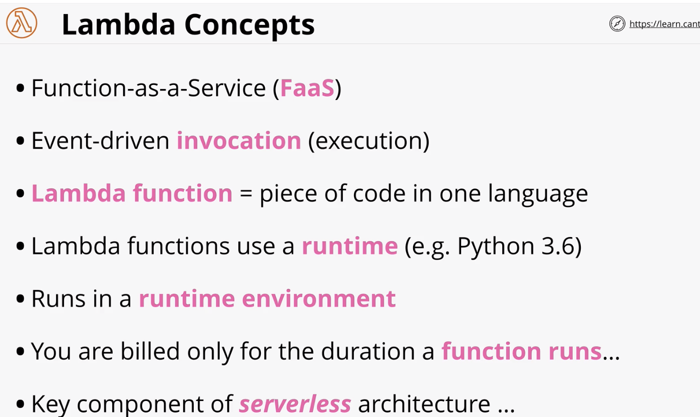

best practice: do one single thing

more memory allocated = more cpu

not persistent

if you want lambda to access public internet resources, you need to config the vpc to support that

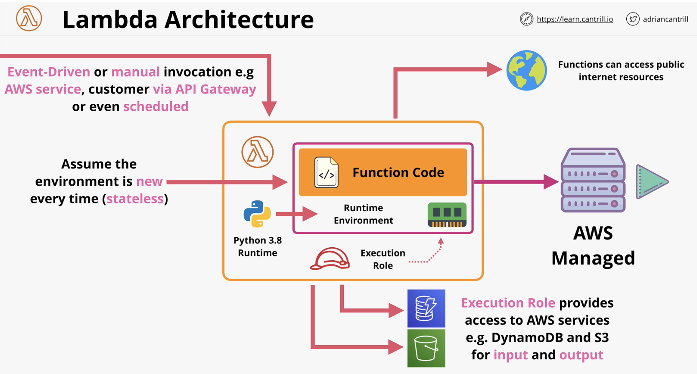

15 minutes execution limit

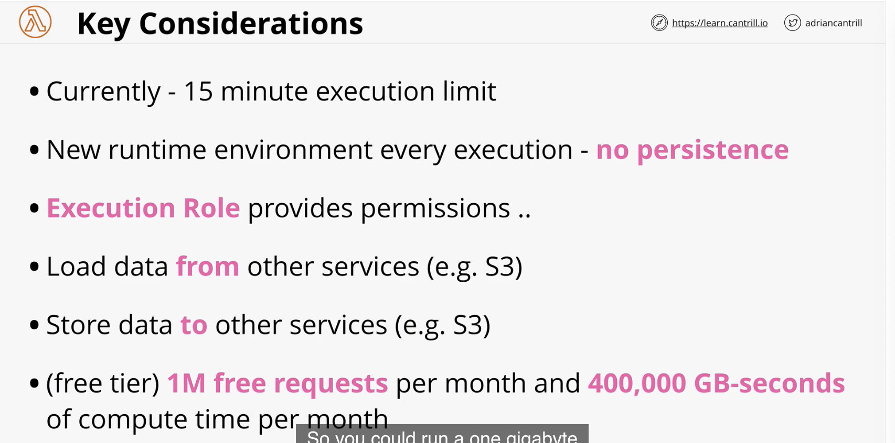

## Cloudwatch events \(old\) and EventBridge \(new\)

CloudWatch Events and EventBridge have visibility over events generated by supported AWS services within an account.

They can monitor the default account event bus - and pattern match events flowing through and deliver these events to multiple targets.

They are also the source of scheduled events which can perform certain actions at certain times of day, days of the week, or multiple combinations of both - using the Unix CRON time expression format.

Both services are one way how event driven architectures can be implemented within AWS.

Cloudwatch events, 1 bus, can't edit

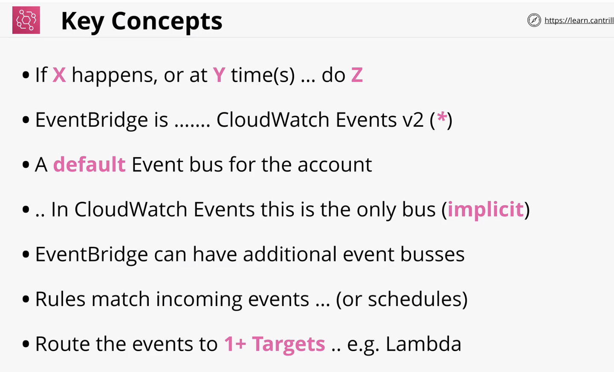

event bus is stream of events that services generate

bridge has rules

match -&gt; execute to target

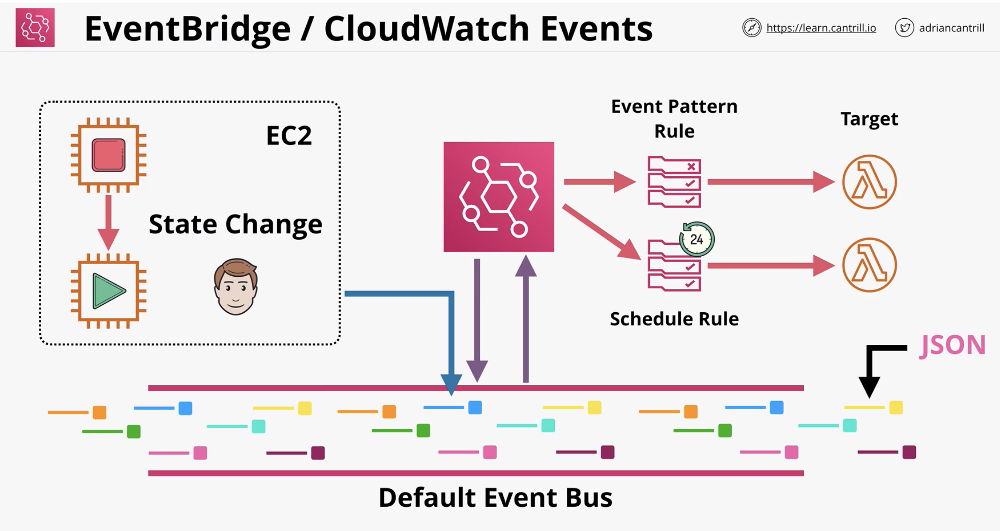

In this \[DEMO\] lesson you will gain experience of using Lambda for some simple account management tasks.

PART1 will deal with simple manual Lambda function invocations

PART2 will give you experience of using an event-driven architecture within AWS using EventBridge

[1-Click Deployment](https://console.aws.amazon.com/cloudformation/home?region=us-east-1#/stacks/create/review?templateURL=https://learn-cantrill-labs.s3.amazonaws.com/awscoursedemos/0024-aws-associate-lambda-eventdrivenlambda/twoec2instances.yaml&stackName=TWOEC2)

[lambdarole.json](https://learn-cantrill-labs.s3.amazonaws.com/awscoursedemos/0024-aws-associate-lambda-eventdrivenlambda/lambdarole.json)

[lambda\_instance\_stop.py](https://learn-cantrill-labs.s3.amazonaws.com/awscoursedemos/0024-aws-associate-lambda-eventdrivenlambda/01_lambda_instance_stop.py)

[lambda\_instance\_start.py](https://learn-cantrill-labs.s3.amazonaws.com/awscoursedemos/0024-aws-associate-lambda-eventdrivenlambda/02_lambda_instance_start.py)

[lambda\_instance\_protect.py](https://learn-cantrill-labs.s3.amazonaws.com/awscoursedemos/0024-aws-associate-lambda-eventdrivenlambda/03_lambda_instance_protect.py)

* create stack from link
* lesson is to create lambda functions
* [lambdarole.json](https://learn-cantrill-labs.s3.amazonaws.com/awscoursedemos/0024-aws-associate-lambda-eventdrivenlambda/lambdarole.json) for permissions for lambda
* iam -&gt; role -&gt; create role for aws service lambda \(ec2LambdaStartAndStop\) -&gt; create policy \(paste [lambdarole.json](https://learn-cantrill-labs.s3.amazonaws.com/awscoursedemos/0024-aws-associate-lambda-eventdrivenlambda/lambdarole.json)\), create role with policy
* go to ec2 -&gt; copy instances id
* go to lambda -&gt; create from scratch -&gt; \(name: ec2stop\), python 3.8, change default execution role: choose ec2LambdaStartAndStop, create -&gt; function code, replace skeleton code with  [lambda\_instance\_stop.py](https://learn-cantrill-labs.s3.amazonaws.com/awscoursedemos/0024-aws-associate-lambda-eventdrivenlambda/01_lambda_instance_stop.py)
* scroll down to env var -&gt; edit -&gt; {key: EC2\_INSTANCES, value: {instance id},{instance id}}
* test function via create new test event -&gt; use any event name \(no need for params\)
* check ec2 instances, it should stop
* Create lambda for start

  * go to lambda -&gt; create from scratch -&gt; \(name: ec2start\), python 3.8, change default execution role: choose ec2LambdaStartAndStop, create -&gt; function code, replace skeleton code with [lambda\_instance\_start.py](https://learn-cantrill-labs.s3.amazonaws.com/awscoursedemos/0024-aws-associate-lambda-eventdrivenlambda/02_lambda_instance_start.py)
  * scroll down to env var -&gt; edit -&gt; {key: EC2\_INSTANCES, value: {instance id},{instance id}}
  * test function via create new test event -&gt; use any event name \(no need for params\)
  * check ec2 instances, it should start

* Create lambda for protect \(if instance is stopped, it will trigger lambda to restart instances that are protected\)
  * go to lambda -&gt; create from scratch -&gt; \(name: ec2protect\), python 3.8, change default execution role: choose ec2LambdaStartAndStop, create -&gt; function code, replace skeleton code with [lambda\_instance\_protect.py](https://learn-cantrill-labs.s3.amazonaws.com/awscoursedemos/0024-aws-associate-lambda-eventdrivenlambda/03_lambda_instance_protect.py)
  * event bridge -&gt; create rule -&gt; ec2Protect \(start protected instances\) -&gt; event pattern -&gt; predefined pattern -&gt; aws service -&gt; ec2 -&gt; ec2 instance state change notification \(sample event, state:...\) -&gt; specific state: stopped -&gt; copy instance 1 id -&gt; choose specific instance paste id -&gt; choose default event bus -&gt; target \(ec2Protect\)
  * stop instance 1 should restart it
* cloudwatch -&gt; log group \(ec2 protect\), lambda prints an event log when invoked
* schedule rule -&gt; lambda -&gt; schedule, cron expression: {minute} {hour} {day of month} {month} {day of week} {year} in utc timezone

