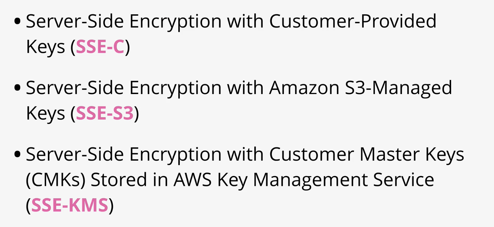

# SIMPLE STORAGE SERVICE \(S3\)

### S3

s3 is private by default


can allow by principal \(person/ role\), bucket policies can be used to allow access by anonymous


Bucket Policy Examples : [https://docs.aws.amazon.com/AmazonS3/latest/dev/example-bucket-policies.html](https://docs.aws.amazon.com/AmazonS3/latest/dev/example-bucket-policies.html)

one policy but multiple statements possible

for external acct to access yr bucket, resource policy needs to allow, and their service policy needs to allow

### ACL

less used, and legacy


### Block public access

another security feature to override your settings


### s3 static website hosting

need index and error documents

Accessing S3 is generally done via APIs

Static Website Hosting is a feature of the product which lets you define a HTTP endpoint, set index and error documents and use S3 like a website.


offloading: dynamic html page using compute service, pings s3 for static files

out-of-band pages: eg if server is down, maintanence page is hosted by s3


### pricing

per gb month charge

into s3 free

out of s3 per gb

operations in s3 different cost per 1000 operations

cheap

### demo \(s3 web server\)

[https://learn.cantrill.io/courses/730712/lectures/26226206](https://learn.cantrill.io/courses/730712/lectures/26226206)

* go to s3, create bucket \({name}.domain name\)
* uncheck block public access, create bucket
* bucket name needs to be unique
* click bucket, edit static website hosting
* specify index document, error document \(error.html\)
* copy bucket url, upload error.html, index.html
* add folder, add images
* choose whether bucket versioning
* if you go to bucket url, it's 403
* don't use actions &gt; make public
* permission &gt; bucket policy &gt; create bucket policy with allow public
* go to properties to check your url \(you can use route 53 if you have a custom domain\)
* route 53 &gt; simple record &gt; create record \(eg below\)


### Object versioning

default is disabled, but once enabled, can't be disabled, only suspended


versioning allocates id, operations that modify objects generates new ver


if you delete an obj, you create a delete marker


You can delete a specific version


### MFA delete


### You can overwrite files by names without versioning

### Demo



* set up s3 bucket
* enable versioning
* replace a file with the same name with another file
* looks like it's overwritten, but you can toggle `list versions`
* delete objects adds delete markers to them
* to undelete object, delete the delete marker
* to permanently delete object at version, delete the version
* you can suspend, but it only stops new ver from being saved

### s3 optimization


This lesson reviews how S3 Uploads \(PutObject\) works

Single PUT Upload \(not recommended if &gt;100mb\)


Multipart Upload


Finishing up by reviewing how S3 Transfer Acceleration works and how it could benefit Animals4life remote workers when uploading large data sets.

no control over internet paths


S3 Transfer Acceleration is off by default


Bucket names cannot contain periods, need to be DNS compatible 


remote worker connects to -&gt; edge location uses-&gt; aws global network to link to -&gt;s3 bucket


the further the bucket is, the better the improvement

### Demo

* create bucket
* select bucket &gt; transfer acceleration, get endpoint \(edge location\)
* check speed with aws test

AWS Accelerated Transfer Tool : [http://s3-accelerate-speedtest.s3-accelerate.amazonaws.com/en/accelerate-speed-comparsion.html](http://s3-accelerate-speedtest.s3-accelerate.amazonaws.com/en/accelerate-speed-comparsion.html)

### Encryption


Difference between encryption at rest, and encryption in transit.

at rest: 'local', one entity

in transit: encryption tunnel \(outsiders can't see\), multiple entities


plaintext: unencrypted data, can be doc, image, or app

algorithm: math/ code that takes secret and encrypts it with an algorithm

key: cipher

ciphertext: encrypted data


Symmetric encryption


symmetric encryption is not ideal for transit encyption, because you need a way to transfer the key

assymetric: choose algo, both make pub and priv keys, priv key needs to be used to decrypt stuff encrypted w pub key. 

upload pub key to be shared. the other party encrypt w pub key.


cat only knows robot has received by 'ok'

'ok' can be proven to be from robot with signing w priv key.

use pub key to check if ok is signed w priv key

### steganography

hiding that you are hiding \(encrypting\) sth -- plausible deniability

algo can't easily be detected unless you know the algo \(eg: image pixel changes\)


### KMS \(key management service\)


comply FIPS 140 level 2


* create a key, customer master key
* kms encrypts cmk
* client makes a encrypt call \(using permission\)
* client decrypts file \(using permission\)
* cmk NEVER leaves kms


dek is created w cmk, bypass 4kb limit, linked to a specific cmk

kms does not store dek, it creates and then discards it

it stores the encrypted key w data


aws managed \(using kms\) - cmk rotation is mandatory


key policy is on cmk


you need both key policy and iam policy

you can be permissioned to only create key but not encrypt/decrypt

### Demo



* kms, customer managed key, kms
* alias for key
* key admin, this is the role that can create and delete key
* key usage, role to decrypt and encrypt
* review key policy
* encypt w cmk

Note : the commands required will be different based on using 1\) Windows 10, or 2\) macOS/Linux

`# Shared  
echo "find all the doggos, distract them with the yumz" > battleplans.txt` 

`Windows Commands`   
`aws kms encrypt --key-id alias/catrobot --plaintext fileb://battleplans.txt --output text --profile iamadmin-general --query CiphertextBlob > battleplans.base64   
  
certutil -decode battleplans.base64 not_battleplans.enc   
  
aws kms decrypt --ciphertext-blob fileb://not_battleplans.enc --output text --profile iamadmin-general --query Plaintext > decreyptedplans.base64   
  
certutil -decode decreyptedplans.base64 decryptedplans.txt #` 

`Linux/macOS commands   
aws kms encrypt \   
 --key-id alias/catrobot \  
 --plaintext fileb://battleplans.txt \  
 --output text \  
 --query CiphertextBlob \  
 --profile iamadmin-general | base64 \  
 --decode > not_battleplans.enc   
  
aws kms decrypt \  
 --ciphertext-blob fileb://not_battleplans.enc \  
 --output text \  
 --profile iamadmin-general \  
 --query Plaintext | base64 --decode > decryptedplans.txt`

some services creates aws managed keys

### Object encryption


Encryption at rest:

client-side means it's uploaded encrypted

server-side means user uploads in plain text but aws encrypts it 




SSE-C: offload the encryption process to aws, you supply the key and plaintext

aws discard keys after, good for heavy regulated applications, but you NEED TO MANAGE KEYS


SSE-S3: aws manages encryption and keys, creates master key which is not visible. key for object encryoption is created and encrypted w master key. plaintext object key is discarded, and encrypted object key is stored w object.

Default, but not suitable if you are heavily regulated, need control over keys or rotation or role separation \(eg diff sets of permission\) 


you can manage the cons of SSE-S3 by using SSE KMS

master key is a CMK stored in KMS , which you have control over

you can put permissions on cmk, so s3 admin don't have decrypting access to s3 obj unless otherwise specified


header set to enable encryption server side: x-amz-server-side-encryption, per object

Bucket default encryption: default encryption used unless otherwise specified


### Demo



KMS, create cmk key, symmetric key, don't set key policy atm

upload img, enable server side encyption, if kms, choose key

open iam, open user, deny user kms:

```text
{
    "Version": "2012-10-17",
    "Statement": [
        {
            "Sid": "VisualEditor0",
            "Effect": "Deny",
            "Action": "kms:*",
            "Resource": "*"
        }
    ]
}
```

edit default encryption: on bucket

### S3 storage classes

### Standard

default : s3 standard, az resilient


s3 standard: frequent access and non replaceable

### Standard-IA

cheaper than standard, storage cost

retrieval fee is expensive, for infrequently access

min duration 30days billing

min capacity of object is 128kb \(not cost effective for small objects\)


### one zone-IA

diff w standard IA is one AZ storage, durable cept AZ failure, data is non critical and replaceable, don't use if only one copy


### Glacial 

1/5 of cost of standard

very infrequent access, cold obj \(not immediate access\), when retrieved, it goes to IA temporarily

first btye latency of minutes or hours

archival data


### Glacial deep archive

cheapest, 'frozen' state, retrieval time is much longer


### Intelligent tiering

contains 4 different tiers

auto migrating based on metrics

same costs for storing + monitoring costs 


long-lived data and changing/ unknown usage patterns

## s3 lifecycle config

transition objects between storage tiers by duration, 


based on duration not on usage

waterfall \(transition is one way\)

restrictions:

small objects can cost more \(min size\)

min of 30 days before transition on standard

cannot transition multiple times within 30 days in single rule


management tab on bucket

scope of rule \(bucket -all, or certain objs\)

expire - prev ver to delete after days

## s3 replication


