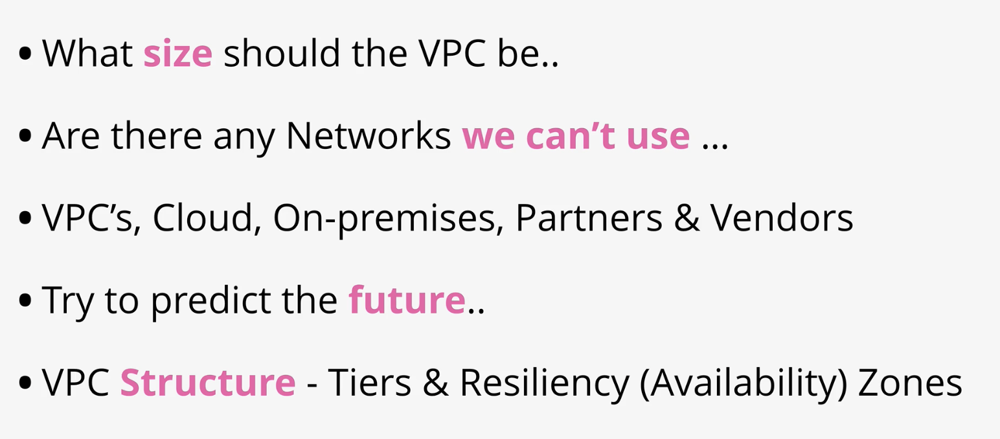

# VIRTUAL PRIVATE CLOUD \(VPC\) BASICS

## Networking refresher

IPv4: 0.0.0.0 to 255.255.255.255

Private-only networks

AWS use class B \(most cloud do\)

## VPC planning

* important cos it's foundation for later on
* avoid ranges other parties use

