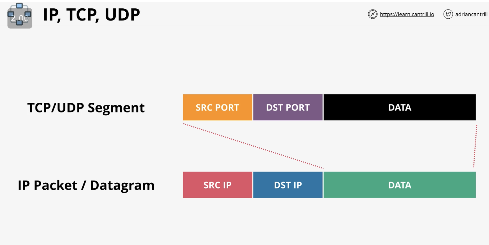

# VIRTUAL PRIVATE CLOUD \(VPC\) BASICS

## Networking refresher

IPv4: 0.0.0.0 to 255.255.255.255

Private-only networks

AWS use class B \(most cloud do\)

## VPC planning

* important cos it's foundation for later on
* avoid ranges other parties use

azure is using default vpc of aws, AVOID using default vpc if possible

use 10.16.y.z range \(16 is nice base 2 number, avoid 10.0, and 10.1 and 10.10 cos other folks tend to use them\)

Lesson Links

[https://aws.amazon.com/answers/networking/aws-single-vpc-design/](https://aws.amazon.com/answers/networking/aws-single-vpc-design/)

[https://cloud.google.com/vpc/docs/vpc](https://cloud.google.com/vpc/docs/vpc)



how many AZs? default is usually 3 AZs, then add one spare, so start with at least 4 /18s, futher split into 4 tiers = /20



