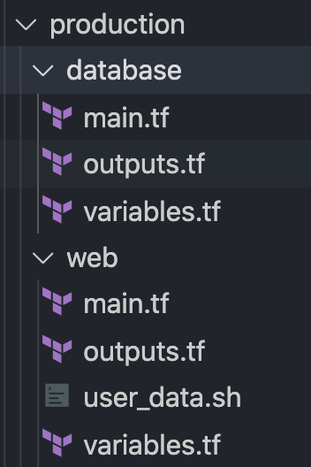

# Terraform + AWS + Rails + Postgres


{variable} indicates a variable to be replaced


### Check if server and postgres can run



```text
RAILS_ENV=production rails s
```

```text
RAILS_ENV=production rake db:create db:migrate db:seed
```

Open postico to check database, where eg: user = {username}, database = {db name} 

### Check if docker image can run locally

```bash
docker network create --attachable {name}

docker run -d --restart unless-stopped --name {database_name} \
  --network {name} \
  --env POSTGRES_DB={name_env} \
  --env POSTGRES_USER={user} \
  --env POSTGRES_PASSWORD={password} \
  postgres:12.3-alpine

docker run -d --name {web} \
  --network {name} \
  -p 3000:3000 \
  --env FITME_DATABASE_USERNAME={user} \
  --env FITME_DATABASE_PASSWORD={password} \
  --env DB_HOST={database_name} \
  --env RAILS_MASTER_KEY={master_key} \
  --cap-drop ALL \
  fitme
```

### Manually send the docker image to ECR

```bash
# Authenticate with AWS CLI
aws configure

# Authenticate ECR
aws ecr get-login-password --region ap-southeast-1 | docker login --username AWS --password-stdin {eg: 352148427474.dkr.ecr.ap-southeast-1.amazonaws.com}

# Tag Docker
docker tag {project_name}:latest {eg: 352148427474.dkr.ecr.ap-southeast-1.amazonaws.com}/{project_name}:latest

# Push image
docker push {eg: 352148427474.dkr.ecr.ap-southeast-1.amazonaws.com}/{project_name}:latest
```

`:latest` can be replaced by git SHA for CircleCi integration later

### Add IAM user role with ECR reading permission


### Run terraform to boot up an EC2 instance


```bash
provider "aws" {
  region  = "ap-southeast-1"
  version = "~> 2.0"
}

terraform {
  backend "s3" {
    bucket = "{project_name}-tf-state"
    key    = "setup/terraform.tfstate"
    region = "{eg: ap-southeast-1}"

    dynamodb_table = "{project_name}-tf-running-locks"
    encrypt        = true
  }
}

resource "aws_ecr_repository" "repo" {
  name = "{project_name}"

  image_scanning_configuration {
    scan_on_push = true
  }
}

resource "aws_ecr_lifecycle_policy" "lifecycle_policy" {
  repository = aws_ecr_repository.repo.name

  policy = <<EOF
    {
        "rules": [
            {
                "rulePriority": 1,
                "description": "Keep last 30 images",
                "selection": {
                    "tagStatus": "any",
                    "countType": "imageCountMoreThan",
                    "countNumber": 30
                },
                "action": {
                    "type": "expire"
                }
            }
        ]
    }
    EOF
}
```


### Login to AWS and check if EC2 instance is created

### 

### SSH into the EC2 instance in AWS and try to run docker inside

Get the key-pair from lastpass, and rename it to `{devname}.pem`.

To ssh into the server:

Add security group with SSH rule added

```bash
chmod 400 sj_developer.pem
ssh -i {devname}.pem ec2-user@{server-public-ip}
```


You need to ssh in via public ip because your client is not part of the same VPC. However, if you're communicating from within the same VPC \(eg: EC2 sibling instances\), you should use private ip by default. 


To run Rails Console once SSH in the server:

```bash
docker exec -it web sh
bin/rails console
```

create the starting script you want to add to terraform \(weirdly named as user\_data.sh\)


```bash
#!/bin/bash
sudo yum -y update
sudo yum -y install unzip

echo "AWS CLI"
curl "https://awscli.amazonaws.com/awscli-exe-linux-x86_64.zip" -o "awscliv2.zip"
unzip awscliv2.zip
sudo ./aws/install

echo "Login ECR"
aws ecr get-login-password --region ap-southeast-1 \
  | docker login --username AWS --password-stdin ${ecr_stdin}

docker network create --attachable fitme-default

docker run -d --name web \
  --network fitme-default \
  -p 3000:3000 \
  --env FITME_DATABASE_USERNAME=${postgres_user} \
  --env FITME_DATABASE_PASSWORD=${postgres_password} \
  --env DB_HOST=${db_host} \
  --env VIRTUAL_HOST=${domain} \
  --env RAILS_MASTER_KEY=${rails_master_key} \
  --cap-drop ALL \
  ${ecr_stdin}/fitme-rails-api:latest

docker run -d --restart unless-stopped --name nginx-proxy \
  --network fitme-default \
  -p 80:80 \
  -p 443:443 \
  --env VIRTUAL_PORT=3000 \
  --volume /var/run/docker.sock:/tmp/docker.sock:ro \
  jwilder/nginx-proxy
```


### Add Nginx layer to EC2

Nginx makes sure users don't hit :3000 directly, for security. 


 This is in the last part of the .sh script, there's:

```text
docker run -d --restart unless-stopped --name nginx-proxy \
  --network fitme-default \
  -p 80:80 \
  -p 443:443 \
  --env VIRTUAL_PORT=3000 \
  --volume /var/run/docker.sock:/tmp/docker.sock:ro \
  jwilder/nginx-proxy
```

Make sure that you support incoming http \(port 80\)/ https \(port 443\) connection in the EC2's security group via terraforming.


Do not edit an EC2 created by terraform directly, and instead provision one using terraform


It looks something like this \(ingress\):


```text
...
resource "aws_security_group" "allow_http" {
  name        = "http_fitme_production"
  description = "Allow HTTP(s) inbound traffic"

  ingress {
    description = "HTTP from VPC"
    from_port   = 80
    to_port     = 80
    protocol    = "tcp"
    cidr_blocks = ["0.0.0.0/0"]
  }

  ingress {
    description = "HTTPS from VPC"
    from_port   = 443
    to_port     = 443
    protocol    = "tcp"
    cidr_blocks = ["0.0.0.0/0"]
  }

  ingress {
    description = "ssh"
    from_port   = 22
    to_port     = 22
    protocol    = "tcp"
    cidr_blocks = ["0.0.0.0/0"]
  }

  egress {
    from_port   = 0
    to_port     = 0
    protocol    = "-1"
    cidr_blocks = ["0.0.0.0/0"]
  }

  tags = {
    Name        = "allow_http"
    Deployer    = "sj_deployer"
    Environment = "production"
  }
}
...
```


We don't care about outbound connections, so egress protocol is -1 \(all protocols allowed\). cidr\_blocks is set to the lax "0.0.0.0/0" which allows all ip addresses, but SSH should be deleted once terrraform file is done.

This should be saved to the same folder as the other tf files.



The file structure should look like the above. Terraform will read all the tf files and run it as one huge file. main.tf is conventionally the main config, outputs.tf is the script to generate outputs \(eg: aws ip address\), variables for the script variables, with secrets in .env using TF VAR name method

### TF\_VAR\_name <a id="tf_var_name"></a>

Environment variables can be used to set variables. The environment variables must be in the format `TF_VAR_name` and this will be checked last for a value. For example:

```text
export TF_VAR_POSTGRES_DB={DB_name}
```

and set up the variables

```text
variable "POSTGRES_DB" {
  type = string
}

variable "ECR_STDIN" {
  type = string
  default = {your_string_here}
}
```

and to use it in the main.tf: 

```text
  user_data = templatefile("./terraform/production/web/user_data.sh", {
    rails_master_key  = var.RAILS_MASTER_KEY,
    ecr_stdin         = var.ECR_STDIN,
    postgres_db       = var.POSTGRES_DB,
    postgres_password = var.POSTGRES_PASSWORD,
    postgres_user     = var.POSTGRES_USER,
    db_host           = data.terraform_remote_state.database.outputs.rds_endpoint,
    domain            = var.DOMAIN
  })
```

then run `source .env` so env is in the environment

The end file looks like this:


```text
provider "aws" {
  region  = "ap-southeast-1"
  version = "~> 2.0"
}

terraform {
  backend "s3" {
    bucket = "fitme-api-tf-state"
    key    = "production/database/terraform.tfstate"
    region = "ap-southeast-1"

    dynamodb_table = "fitme-api-tf-running-locks"
    encrypt        = true
  }
}

data "terraform_remote_state" "web" {
  backend = "s3"
  config = {
    bucket = "fitme-api-tf-state"
    key    = "production/web/terraform.tfstate"
    region = "ap-southeast-1"
  }
}

resource "aws_security_group" "allow_db" {
  name        = "fitme_web_db_connection"
  description = "Allow 5432 access from the web"

  ingress {
    description = "From Web Server"
    from_port   = 5432
    to_port     = 5432
    protocol    = "tcp"
    security_groups = [data.terraform_remote_state.web.outputs.web_security_group_id]
  }

  egress {
    from_port   = 0
    to_port     = 0
    protocol    = "-1"
    cidr_blocks = ["0.0.0.0/0"]
  }

  tags = {
    Name        = "Fitme Rails API DB"
    Deployer    = "sj_deployer"
    Environment = "production"
  }
}

resource "aws_db_instance" "rds" {
  allocated_storage       = 20
  storage_type            = "gp2"
  engine                  = "postgres"
  engine_version          = "12.2"
  instance_class          = "db.t2.micro"
  identifier              = "fitme-production"
  backup_retention_period = 7
  name                    = var.POSTGRES_DB
  username                = var.POSTGRES_USER
  password                = var.POSTGRES_PASSWORD
  vpc_security_group_ids  = [aws_security_group.allow_db.id]
}
```



```text
provider "aws" {
  region = "ap-southeast-1"
}

terraform {
  backend "s3" {
    bucket = "fitme-api-tf-state"
    key    = "production/web/terraform.tfstate"
    region = "ap-southeast-1"

    dynamodb_table = "fitme-api-tf-running-locks"
    encrypt        = true
  }
}

data "terraform_remote_state" "database" {
  backend = "s3"
  config = {
    bucket = "fitme-api-tf-state"
    key    = "production/database/terraform.tfstate"
    region = "ap-southeast-1"
  }
}

resource "aws_security_group" "allow_http" {
  name        = "http_fitme_production"
  description = "Allow HTTP(s) inbound traffic"

  ingress {
    description = "HTTP from VPC"
    from_port   = 80
    to_port     = 80
    protocol    = "tcp"
    cidr_blocks = ["0.0.0.0/0"]
  }

  ingress {
    description = "HTTPS from VPC"
    from_port   = 443
    to_port     = 443
    protocol    = "tcp"
    cidr_blocks = ["0.0.0.0/0"]
  }

  ingress {
    description = "ssh"
    from_port   = 22
    to_port     = 22
    protocol    = "tcp"
    cidr_blocks = ["0.0.0.0/0"]
  }

  egress {
    from_port   = 0
    to_port     = 0
    protocol    = "-1"
    cidr_blocks = ["0.0.0.0/0"]
  }

  tags = {
    Name        = "allow_http"
    Deployer    = "sj_deployer"
    Environment = "production"
  }
}

resource "aws_eip" "web_instance" {
  instance = aws_instance.server.id
}

resource "aws_instance" "server" {
  ami                  = "ami-0fd3e3d7875748187"
  instance_type        = "t2.micro"
  security_groups      = [aws_security_group.allow_http.name]
  key_name             = "sj_developer"
  iam_instance_profile = "ecr_reader"
  availability_zone    = "ap-southeast-1a"

  user_data = templatefile("./terraform/production/web/user_data.sh", {
    rails_master_key  = var.RAILS_MASTER_KEY,
    ecr_stdin         = var.ECR_STDIN,
    postgres_db       = var.POSTGRES_DB,
    postgres_password = var.POSTGRES_PASSWORD,
    postgres_user     = var.POSTGRES_USER,
    db_host           = data.terraform_remote_state.database.outputs.rds_endpoint,
    domain            = var.DOMAIN
  })

  tags = {
    Name        = "fitme-rails-api-production"
    Deployer    = "sj_deployer"
    Environment = "production"
  }
}
```


### Elastic IP so don't have to update cloudflare

```text
resource "aws_eip" "web_instance" {
  instance = aws_instance.server.id
}
```

